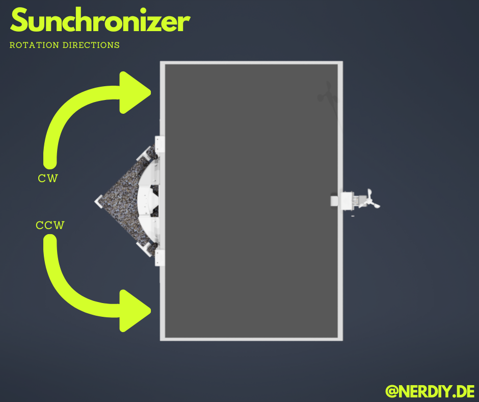

# Sunchronizer — Frequently Asked Questions

This document answers common questions from users and developers about the Sunchronizer project.

---

## Table of Contents

**[General Questions](#general-questions)**
- [Why should I build a solar tracker? What are the actual advantages?](#q-why-should-i-build-a-solar-tracker-what-are-the-actual-advantages)
- [Can I use this without Home Assistant?](#q-can-i-use-this-without-home-assistant)
- [What's the difference between S1, S2, D1, and D2?](#q-whats-the-difference-between-s1-s2-d1-and-d2)
- [Why not just build a polar-aligned single-axis tracker?](#q-why-not-just-build-a-single-axis-tracker-that-rotates-around-an-axis-parallel-to-earths-rotation-axis-polar-aligned-tracker-that-would-track-the-sun-perfectly-with-only-one-motor)
- [Why does CH2 (S2) sometimes show higher peak power than CH4 (D2)?](#q-why-does-ch2-sunchronizer-s2-sometimes-show-higher-peak-power-than-ch4-sunchronizer-d2-even-though-d2-uses-full-dual-axis-tracking)
- [What are the disadvantages of a solar tracker?](#q-what-are-the-disadvantages-of-a-solar-tracker)
- [Can I modify the firmware?](#q-can-i-modify-the-firmware)
- [Where can I get the 3D models (STLs)?](#q-where-can-i-get-the-3d-models-stls)
- [What if I have problems?](#q-what-if-i-have-problems)

**[Assembly & Getting Started](#assembly--getting-started)**
- [What do the STL files include?](#q-im-interested-in-building-the-sunchronizer-d2-what-do-the-stl-files-include-do-i-get-assembly-instructions-component-lists-and-pdfs)

**[Hardware & Construction](#hardware--construction)**
- [What are the possible mounting options?](#q-what-are-the-possible-mounting-options-for-fixing-the-tracker-to-concrete-base-weightslabs)
- [Will the construction support a 500W solar panel?](#q-will-the-construction-support-a-500w-solar-panel)
- [What about end-of-travel switches?](#q-what-about-end-of-travel-switches-are-they-mandatory)
- [Which motor for the azimuth axis?](#q-which-motor-do-you-recommend-for-the-azimuth-axis-on-the-sunchronizer-d2)
- [Which rotation direction is CW / CCW?](#q-which-rotation-direction-is-cw--ccw)

**[Firmware & Software](#firmware--software)**
- [Where are the binary files to flash the ESP?](#q-where-are-the-binary-files-to-flash-the-esp)
- [What ESPHome external components are used?](#q-what-are-the-esphome-external-components-used-by-the-firmware)
- [Can I use a different microcontroller?](#q-can-i-use-a-different-microcontroller)

**[GPS & Position Data](#gps--position-data)**
- [Do I need a GPS module? Can I run without GPS?](#q-do-i-need-a-gps-module-can-i-run-the-sunchronizer-without-gps)

**[Technical Details & Algorithms](#technical-details--algorithms)**
- [How are elevation and azimuth angles calculated?](#q-how-are-elevation-and-azimuth-angles-calculated)

**[Integration & Connectivity](#integration--connectivity)**
- [Do I need WiFi for the tracker to work?](#q-do-i-need-wifi-for-the-tracker-to-work)
- [How does Home Assistant integration work?](#q-how-does-home-assistant-integration-work)

**[Performance & Reliability](#performance--reliability)**
- [How much energy does the Sunchronizer produce?](#q-how-much-energy-does-the-sunchronizer-produce)

**[Support & Community](#support--community)**
- [Is there a community or forum?](#q-is-there-a-community-or-forum)
- [How can I contribute or request features?](#q-how-can-i-contribute-or-request-features)

**[Licensing & Legal](#licensing--legal)**
- [What license is this project under?](#q-what-license-is-this-project-under)
- [Can I use this commercially?](#q-can-i-use-this-commercially)

**[Troubleshooting](#troubleshooting)**
- [The motor isn't moving. What's wrong?](#q-the-motor-isnt-moving-whats-wrong)
- [WiFi connection is unstable or disconnects frequently.](#q-wifi-connection-is-unstable-or-disconnects-frequently)
- [The tracker moves but doesn't face the sun accurately.](#q-the-tracker-moves-but-doesnt-face-the-sun-accurately)

---

## General Questions

### Q: Why should I build a solar tracker? What are the actual advantages?

**A:** A solar tracker keeps a solar panel continuously pointed toward the sun as it moves across the sky throughout the day. Compared to a fixed, statically mounted panel, this yields several concrete benefits:

**1. Significantly more energy per day**
A static panel is only optimally oriented toward the sun for a short time around solar noon. In the morning and evening hours, the angle of incidence is poor and output drops sharply. A tracker eliminates this loss by following the sun from sunrise to sunset.

Based on field measurements in Bochum, Germany (51.4°N latitude, clear-sky days):

| Configuration | Avg. Daily Yield | vs. Best Static Panel |
|---------------|------------------|-----------------------|
| Static West 30° (CH1) | ~1,586 Wh | baseline |
| Static East 30° (CH3) | ~1,169 Wh | baseline |
| **Sunchronizer S2** (1-axis elevation, CH2) | ~2,308 Wh | **+46%** vs. CH1 |
| **Sunchronizer D2** (2-axis, CH4) | ~2,627 Wh | **+66%** vs. CH1 |

> *See [Measurement Analysis Overview](docu/measurements/MEASUREMENT_OVERVIEW.md) for full per-day data.*

**2. More usable energy at the times you need it**
A tracker extends the period of high power output into the morning and afternoon hours, which better matches typical household consumption patterns. A static panel produces most of its energy in a narrow midday window, which often exceeds local consumption and must be exported to the grid at lower compensation rates.

**3. Better use of the panel's rated capacity**
Solar panels are sold by their peak power (Wp), which is only reached under ideal perpendicular irradiance. A static panel rarely reaches this rated value in practice because the angle of incidence is almost never optimal. A dual-axis tracker keeps the panel near perpendicular to the sun for the majority of daylight hours, making far better use of the panel's rated capacity.

**4. Higher self-consumption / reduced grid dependence**
By spreading production more evenly across the day, a tracker increases the share of solar energy consumed directly in the household (self-consumption), which reduces grid draw and improves the economics of the system — especially relevant where feed-in tariffs are low.

**5. Smaller panel for the same daily yield**
If you have limited installation space or budget, a tracker allows you to achieve the same daily energy output with a smaller (and cheaper) panel compared to a fixed installation. Alternatively: the same panel produces substantially more energy.

**6. Good conscience — a small but real contribution to the energy transition**
Every kilowatt-hour generated locally from sunlight is one that doesn't need to come from fossil or nuclear sources. Building and operating a solar tracker means you're actively contributing to the shift toward renewable energy — reducing your household's carbon footprint, cutting your electricity bill, and demonstrating that efficient, DIY-built renewable systems are feasible for private individuals. It may be a small contribution in the grand scheme, but it is a tangible and measurable one.

> **See also:** [What are the disadvantages of a solar tracker?](#q-what-are-the-disadvantages-of-a-solar-tracker)

**Bottom line:** In clear-sky or mixed conditions at mid-latitudes, a dual-axis tracker like the Sunchronizer D2 reliably produces **50–80% more energy per day** than a comparably sized static panel. For a 400 W panel in central Europe, this translates to a meaningful real-world gain in daily yield.

---

### Q: What are the disadvantages of a solar tracker?

**A:** A solar tracker is not always the right choice for every situation. Here are the most relevant drawbacks to consider before building one:

**1. Mechanical complexity and maintenance**
Unlike a fixed panel, a tracker has moving parts — motors, actuators, gears, bearings, and 3D-printed structural components. These are subject to wear over time and require periodic inspection and occasional maintenance. Outdoor exposure to rain, UV radiation, temperature cycles, and wind loads accelerates ageing of plastic parts in particular.

**2. Higher initial cost and build effort**
The components required for a tracker (motors, motor drivers, microcontroller, IMU, GPS, actuator, wiring) add meaningful cost compared to a simple fixed mount. The build also takes more time, skill, and tooling. For small panels or short usage periods, the additional energy yield may not offset this investment.

**3. Reduced benefit under diffuse/overcast conditions**
A tracker primarily helps with **direct (beam) irradiance** — sunlight arriving in a clear, defined direction. On heavily overcast days, sunlight is scattered diffusely across the entire sky dome, and pointing the panel at the (invisible) sun position yields little additional gain. In climates with persistently cloudy weather, the benefit of tracking is significantly reduced compared to sunny or mixed-sky locations.

**4. Single point of failure**
If a motor, controller, or sensor fails, the tracker may stop moving — or worse, move to an unfavorable position. A fixed panel, by contrast, continues producing energy without any active components. For critical applications, this reliability difference matters.

**5. Wind load and storm risk**
A vertically or steeply tilted tracking panel presents a larger effective surface to wind than a low-angle fixed panel. In strong wind events, this increases mechanical stress. The Sunchronizer firmware includes a configurable **storm position** (flat/retracted angle) to mitigate this. It also includes a function to **automatically fold the tracker to the storm position when wind speed exceeds a configurable threshold** — provided the feature is enabled in the firmware configuration. Nevertheless, a **residual risk remains**: wind gusts can be sudden and exceed sensor response time, and a sensor or firmware failure could prevent automatic retraction. The tracker should not be left unattended during forecasted storm conditions without ensuring the storm position function is properly set up and tested.

**6. Complexity of installation**
A tracker requires a stable foundation (e.g. concrete slab with anchor bolts for D2), correct wiring, firmware configuration, GPS or manual location setup, and initial calibration. This is more involved than simply mounting a panel at a fixed angle.

**Bottom line:** For locations with significant direct sunlight and users comfortable with DIY electronics, these trade-offs are well worth it — the energy gains are substantial and well-documented. For locations with frequent cloud cover, very small panels, or users seeking absolute simplicity, a fixed mount may be the more practical choice.

> **See also:** [Why should I build a solar tracker? What are the actual advantages?](#q-why-should-i-build-a-solar-tracker-what-are-the-actual-advantages)

---

### Q: Can I use this without Home Assistant?

**A:** Yes! The system can operate completely independently using GPS for position data and time. GPS is sufficient to:
- Calculate sun position automatically
- Track elevation and azimuth
- Run without network connectivity

However, Home Assistant integration adds convenience and monitoring capabilities. Without HA, you control the tracker via physical buttons or the built-in web interface.

**See also:** [Firmware Configuration Guide](firmware/README.md)

---

### Q: What's the difference between S1, S2, D1, and D2?

**A:** The naming follows a simple two-part convention:

- **First letter** — tracking axes:
  - **S** = Single-axis (elevation only — tilts the panel up/down)
  - **D** = Dual-axis (elevation + azimuth — tilts up/down AND rotates left/right)

- **Number** — generation/iteration:
  - **1** = First generation
  - **2** = Improved second generation (refined mechanics, better performance)

**Overview:**

| Variant | Axes | Generation | Best For |
|---------|------|------------|----------|
| ~~**S1**~~ ⚠️ (deprecated) | ~~Elevation only~~ | ~~1st gen~~ | ~~Simple installs, fixed azimuth~~ — **deprecated**, use **S2** |
| **S2** | Elevation only | 2nd gen | Improved single-axis, lower complexity |
| ~~**D1**~~ ⚠️ (deprecated) | ~~Elevation + Azimuth~~ | ~~1st gen~~ | ~~Full dual-axis tracking~~ — **deprecated**, use **D2** |
| **D2** | Elevation + Azimuth | 2nd gen | Maximum efficiency, production-ready |

**Performance:** Dual-axis (D1/D2) yields **~12-15% more energy** than single-axis (S1/S2) over a full day.

**Current Recommendation:**
- **Maximum efficiency:** D2 — latest, most tested, full 2-axis tracking
- **Simpler build:** S2 — lower complexity, still very effective

**See also:** [Measurement Analysis Overview](docu/measurements/MEASUREMENT_OVERVIEW.md) for real performance data comparing S2 vs D2.

---

### Q: Why not just build a single-axis tracker that rotates around an axis parallel to Earth's rotation axis (polar-aligned tracker)? That would track the sun perfectly with only one motor!

**A:** You're absolutely right — a polar-aligned single-axis tracker is an elegant solution from a purely astronomical standpoint. By tilting the rotation axis to match the local latitude, the sun's apparent daily arc can be followed with a single rotational motion and very little error throughout the year.

However, this approach comes with a set of practical trade-offs that make it less suitable as a modular, reproducible, and low-cost DIY system:

- **Foundation and post requirements:** A polar-aligned tracker needs a rigid vertical post or mast with its axis precisely tilted to the local latitude angle. This typically requires a concrete foundation designed to handle the resulting torque and wind loads — a significantly more complex and site-specific installation than placing a slab on the ground.
- **Wind load geometry:** Rotating the panel around a tilted axis means the panel face sweeps through a wide range of orientations over the day. At certain times (especially early morning or late evening), the panel presents a large surface area nearly perpendicular to wind gusts, which substantially increases the mechanical stress on the structure compared to a tracker that keeps the panel closer to a horizontal rest position.
- **Complexity vs. reproducibility:** Precise polar alignment requires accurate setup at the installation site, which adds calibration effort and reduces plug-and-play simplicity.

That said — as with most engineering problems, there is no single "correct" solution. Polar-aligned trackers are widely used in professional and amateur astronomy setups, and they work very well for the right context.

The Sunchronizer's design philosophy is a deliberate compromise: **easy to set up, affordable, 3D-printable, and reproducible** across different locations without site-specific engineering. The elevation + azimuth dual-axis approach (D2) achieves near-optimal solar alignment without requiring a post, a foundation, or precise polar alignment.

*As the saying goes: all solar trackers are beautiful — it just depends on what you're optimizing for.* 😄

---

### Q: Why does CH2 (Sunchronizer S2) sometimes show higher peak power than CH4 (Sunchronizer D2), even though D2 uses full dual-axis tracking?

**A:** This is a common point of confusion — and it comes down to **different solar panels**, not tracking performance.

The two trackers are intentionally paired with different panels:

| Channel | System | Panel Model | Rated Power |
|---------|--------|-------------|-------------|
| CH2 | Sunchronizer S2 (1-axis elevation) | CHSM54M-HC-405 | **405 W** |
| CH4 | Sunchronizer D2 (2-axis) | JAM54S31-395 | **395 W** |

CH2's panel has a **10 W higher nameplate rating** than CH4's panel. Under ideal momentary conditions — when the sun's elevation angle happens to align perfectly with the S2's fixed tilt and the sun is roughly south-facing — CH2 can briefly reach a slightly higher instantaneous power output simply because its panel has a higher peak capacity.

**However, this momentary peak does not reflect sustained tracking quality.** There are two key reasons why CH4 wins over a full day despite this:

1. **Dual-axis tracking maintains optimal alignment throughout the day.** As the sun moves both in elevation and azimuth, CH4 continuously corrects both angles. CH2 can only adjust elevation — the azimuth angle is fixed — so it deviates from the solar optimum for most of the day.

2. **Average power matters more than peak power for daily yield.** A brief peak at one instant contributes very little to total energy. CH4 consistently maintains a higher average power across all daylight hours, which accumulates into a significantly higher daily yield (typically **~12–15% more than CH2** across our measurements).

**In short:** The higher momentary peak of CH2 is an artifact of its slightly larger panel rating, not a sign of superior tracking. The daily energy yield — not the peak — is the relevant metric for practical solar performance.

**See also:** [Measurement Analysis Overview](docu/measurements/MEASUREMENT_OVERVIEW.md) for real-world yield comparisons across multiple days.

---

### Q: Can I modify the firmware?

**A:** Absolutely! The configuration is fully editable:
- All firmware files are open-source (AGPL-3.0)
- Configuration uses [ESPHome YAML](https://esphome.io/) — human-readable, not compiled
- Customize tracking algorithms, sensor thresholds, WiFi settings, and more
- Export and compile your own changes

**See also:** [Firmware Configuration Guide](firmware/config/pcb_v1.3/README.md)

---

### Q: Where can I get the 3D models (STLs)?

**A:** STL files are available for purchase on the official store:

| Variant | Nerdiy.de | Printables | Cults |
|---------|-----------|------------|--------|
| ~~**Sunchronizer S1**~~ ⚠️ (single-axis, 1st gen — **deprecated**, use S2) | [Nerdiy.de](https://nerdiy.de/en/product-2/sunchronizer-s1-400w-solartracker-fuer-elevation-achse-3d-druckbar-stl-dateien/) | — | — |
| **Sunchronizer S2** (single-axis, 2nd gen) | — | [Printables](https://www.printables.com/model/1574048-sunchronizer-s2-400w-module-solartracker-for-eleva) | [Cults](https://cults3d.com/de/modell-3d/gadget/sunchronizer-s2-400w-module-solartracker-for-elevation-axis-by-nerdiy-de-new) |
| ~~**Sunchronizer D1**~~ ⚠️ (dual-axis, 1st gen — **deprecated**, use D2) | [Nerdiy.de](https://nerdiy.de/en/product-2/sunchronizer-d1-dual-axis-solartracker-fuer-azimut-und-elevation-achse-3d-druckbar-stl-dateien/) | — | — |
| **Sunchronizer D2** (dual-axis, 2nd gen) | — | [Printables](https://www.printables.com/model/1574049-sunchronizer-d2-400w-module-solartracker-for-eleva) | [Cults](https://cults3d.com/de/modell-3d/gadget/sunchronizer-d2-400w-module-solartracker-for-elevation-azimuth-axis-by-nerdi) |

The STL files include a complete bill of materials and assembly instructions.

---

### Q: What if I have problems?

**A:** Here's where to begin:
1. **Check the [GitHub Wiki](https://github.com/Nerdiyde/Sunchronizer/wiki)** — comprehensive documentation with troubleshooting sections
2. **Review the [Firmware Guide](firmware/README.md)** — covers flashing and common setup issues
3. **Search [existing GitHub issues](https://github.com/Nerdiyde/Sunchronizer/issues)** — your question may already be answered
4. **Create a new issue** with details (setup, error messages, logs) — describe what you've tried
5. **Consult the [ESPHome documentation](https://esphome.io/)** — for firmware-specific questions

---

## Assembly & Getting Started

### Q: I'm interested in building the Sunchronizer D2. What do the STL files include? Do I get assembly instructions, component lists, and PDFs?

**A:** The **product files** available on [Nerdiy.de](https://nerdiy.de/) and [Printables](https://www.printables.com/) include:

✅ **What's Included:**
- All STL files (3D-printable parts) for D2/D1 variants
- Complete Bill of Materials (BOM) with part numbers and supplier links
- Wiring diagram (interactive HTML + YAML source)
- Firmware configuration guide
- Step-by-step assembly documentation with photos
- Component specifications and datasheets

✅ **Additional Resources** (in this GitHub repository):
- [Firmware Configuration Guide](firmware/README.md) — how to flash and configure the ESP
- [Bill of Materials](bom/BOM.md) — comprehensive component list with links
- [Cable Plan & Wiring Diagrams](docu/cable_plan/) — detailed connection documentation
- [Prototype Development History](docu/development_history/DEVELOPMENT_HISTORY.md) — see how it's built
- [Full Wiki](https://github.com/Nerdiyde/Sunchronizer/wiki) — detailed technical documentation

**Recommendation:**
1. **Purchase the STL files** from [Nerdiy.de](https://nerdiy.de/) or [Printables](https://www.printables.com/) — includes assembly PDFs
2. **Alternative marketplace links:** S2 and D2 are also available on [Cults3D](https://cults3d.com/)
3. **Review this GitHub repo** — additional documentation, measurement data, and firmware guides
4. **Check the [Wiki](https://github.com/Nerdiyde/Sunchronizer/wiki)** — answers common assembly questions
5. **Start with the BOM** — gather all components before printing

You will have **everything needed** to successfully assemble your tracker! 🚀

---

## Hardware & Construction

### Q: What are the possible mounting options for fixing the tracker to concrete base weight/slabs?

**A:** There are two supported mounting methods for concrete-based installations:

1. **Method 1 (S2 only):**
   Mount using an endless stainless hose clamp that runs around both the aluminum profile and the concrete weight.
   This method uses a dedicated 3D-printed holder to guide and secure the clamp path.

2. **Method 2 (mandatory for D2, optional for S2):**
   Drill into the concrete slab/paving stone and fix the tracker with concrete anchors.
   For D2, this is the only supported mounting method.

See also the [Bill of Materials (BOM)](bom/BOM.md). The required material for both mounting methods is listed there, including quantities and links.

---

### Q: Will the construction support a 500W solar panel?
### (Dimensions: 1960 × 1134 × 30 mm, Weight: ~ 26.6 kg)

**A:** The Sunchronizer is currently **designed and tested with 400 W solar panels** (~19-20 kg weight). A 500 W panel at **26.6 kg is significantly heavier** and requires careful consideration:

**Technical Specification:**
- **Linear Actuator Capacity:** 6000 N force (approximately 612 kg at earth gravity)
- **Mechanical Advantage:** The geared motor and lever system provide significant force multiplication
- **Expected Load Tolerance:** Based on the 6000 N actuator, **500W panels (26.6 kg) will likely be supported** — the actuator has ample capacity

**However:**
⚠️ **This configuration has NOT been tested** with 500W panels — use at your own risk.

**What You Must Verify Before Building:**
1. **Structural stress test:** Mount the 500W panel at typical operating angles (30-45°) and verify:
   - Motor current during motion (should not exceed specs)
   - Actuator extension/contraction is smooth and balanced
   - No excessive flex in 3D-printed mounting brackets
2. **Temperature monitoring:** Check motor temperature under load and full sun
3. **Safety margin:** Test at angles beyond normal operation to confirm safety limits
4. **Printed parts reinforcement:** Consider reinforcing critical joints with metal inserts or printed-in supports

**Recommendation:**
- **If you proceed:** Test gradually and monitor closely during first operation
- **Structural reinforcement:** Consider printing critical parts in stronger materials (PETG, ASA) or adding metal reinforcement

**Bottom Line:** The 6000 N actuator suggests technical feasibility, but **untested configuration = use at your own risk**. Thorough testing required before leaving it unattended outdoors.

---

### Q: What about end-of-travel switches? Are they mandatory?

**A:** **Yes — end-of-travel switches are mandatory, and they are already integrated into the Sunchronizer's construction on both axes.**

- **Elevation axis:** The **linear actuator has built-in endstops**. Its internal limit switches cut motor power at both ends of travel, so the elevation axis cannot physically be driven beyond its limits.
- **Azimuth axis:** **Mechanical endstops are integrated into the Sunchronizer's physical structure** (base ring / frame). These hard stops prevent over-rotation of the azimuth axis.

Because both are mandatory and already built in, no separate external limit switches need to be sourced or wired — the protection is part of the design.


---

### Q: Which motor do you recommend for the azimuth axis on the Sunchronizer D2?

**A:** For the **Sunchronizer D2**, I recommend a **JGY-370 geared motor with 5 RPM** for the azimuth axis.

Slower motors can also work, but then the parameter `azimuth_measurement_max_wait_time` must be adjusted in the firmware configuration, and the firmware must be compiled manually.

---

### Q: Which rotation direction is CW / CCW?

**A:** The diagram below shows the defined clockwise (CW) and counter-clockwise (CCW) directions for the azimuth axis:



---

## Firmware & Software

### Q: Where are the binary files to flash the ESP?

**A:** Download pre-compiled firmware binaries from the project releases:

- **Latest release:** [GitHub Releases (latest)](https://github.com/Nerdiyde/Sunchronizer/releases/latest)
- **All releases:** [GitHub Releases](https://github.com/Nerdiyde/Sunchronizer/releases)

**Quick Start:**
1. Download a binary matching your **PCB version** (v1.3, v1.4, etc.)
2. Install [ESPHome CLI Tool](https://esphome.io/guides/installing_esphome.html) or use [Web Tool](https://web.esphome.io)
3. Flash the binary to your ESP32-S3 XIAO microcontroller
4. Configure WiFi credentials — three options:
   - **Improv via Serial:** Configure WiFi directly over USB using the [Improv Serial protocol](https://www.improv-wifi.com/serial/) (supported out of the box)
   - **Fallback Access Point:** If no WiFi is configured, the ESP opens its own AP — connect to it and enter your credentials via the captive portal
   - **Manual:** Edit credentials in [firmware/config/pcb_v1.3/secrets.yaml](firmware/config/pcb_v1.3/secrets.yaml) before compiling, or set them in `secrets.yaml.example`

**See also:** [Firmware Guide — Flashing Section](firmware/README.md)

---

### Q: What are the ESPHome external components used by the firmware?

**A:** The Sunchronizer firmware depends on two ESPHome external components:

1. **[DS3231 RTC Component](https://github.com/Nerdiyde/DS3231-RTC-component-for-ESPHome/)**
   - Provides precise timekeeping independent of WiFi
   - Maintains time during network outages
   - Essential for GPS-only standalone operation

2. **[BNO085 RVC Component](https://github.com/Nerdiyde/BNO085-RVC-component-for-ESPHome/)**
   - 9-DOF IMU sensor (accelerometer, gyro, magnetometer)
   - Measures elevation angle of the tilted panel
   - Provides compass heading for azimuth verification

Both are open-source and are fetched automatically from their GitHub repositories during the build.

---

### Q: Can I use a different microcontroller?

**A:** The **Sunchronizer is designed for the ESP32-S3 XIAO** and relies on:
- WiFi/Bluetooth (for Home Assistant integration)
- Sufficient GPIO pins for motor drivers, sensors, and buttons
- ESPHome compatibility

**Other boards may work** if they meet these requirements, but:
- PCB design would need modification
- Testing and debugging would be required
- Support cannot be guaranteed

**Recommendation:** Use the recommended ESP32-S3 XIAO to ensure compatibility and simplicity.

---

## GPS & Position Data

### Q: Do I need a GPS module? Can I run the Sunchronizer without GPS?

**A:** **No, GPS is not mandatory.** The tracker can operate without GPS by using one of several alternatives:

**Three Operating Modes:**

| Mode | GPS | Home Assistant | Configuration | Accuracy |
|------|-----|-----------------|----------------|----------|
| **GPS-Only** | ✅ Yes | ❌ Not needed | Auto-detected location/time | High |
| **Home Assistant** | ❌ Optional | ✅ Yes | HA provides location/time | High |
| **Manual Config** | ❌ No | ❌ Not needed | Hardcode lat/lon in firmware | High (if correct) |

**Details:**

**1. GPS Module (Recommended for standalone)**
- Automatically detects location (latitude/longitude) via satellite
- Provides precise time (independent of WiFi/network)
- Best for off-grid installations with no internet
- Typical GPS modules: Neo-6M, Neo-M9N, etc.

**2. Home Assistant (Easiest for connected setups)**
- HA provides your location and time automatically
- Requires WiFi and Home Assistant running
- No GPS module needed
- Simple configuration with YAML

**3. Manual Configuration (No GPS, no HA)**
- Hardcode latitude/longitude directly in firmware
- Requires accurate time (use RTC — DS3231)
- Works without WiFi or GPS
- **Limitation:** Time remains accurate only if RTC is set correctly at startup

**If You Don't Have/Use GPS:**

You **must configure** one of these in the firmware:

**Option B — Manual configuration (no HA, no GPS):**

The coordinates can be set in **three equivalent ways** — pick whichever fits your workflow:

**1. In the firmware config file (before flashing)**

Edit `sunchronizer_firmware_pcb_v1.3.yaml`, find the `coordinates:` substitution block and **change only the values** (the numbers):

```yaml
substitutions:
  coordinates:
    standard_latitude: "51.4556"     # ← Change this number to your latitude
    standard_longitude: "7.0116"     # ← Change this number to your longitude
```

The sun section uses these values automatically:
```yaml
sun:
  latitude: ${coordinates.standard_latitude}
  longitude: ${coordinates.standard_longitude}
```

**2. Via the Home Assistant / ESPHome dashboard (after flashing)**

The coordinates are exposed as configurable numbers in the dashboard. You can change them at any time without reflashing — the new values are **stored persistently in the ESP's flash memory** and survive power cycles.

**3. Hardcoded fallback**

If no dashboard is available and no GPS is connected, the firmware falls back to the `standard_latitude` / `standard_longitude` values baked into the binary at flash time.

**How to find your coordinates:**
1. Use [Google Maps](https://maps.google.com/) — right-click on your location, see decimal coordinates
2. Use [LatLong.net](https://www.latlong.net/) — enter your address
3. Format: **decimal degrees** (not DMS format)
   - **Example:** Bochum = 51.4556°N, 7.0116°E
   - **Example:** Berlin = 52.5200°N, 13.4050°E

**Required in all cases:**
- **RTC (DS3231):** Keeps time accurate even after power loss
- **Accurate initial time:** Set the RTC time correctly on first boot (via WiFi or manually)
- **Correct latitude/longitude:** Errors here = tracking errors

**Recommendation:**
- **For autonomous/off-grid:** Use GPS module (most reliable)
- **For Home Assistant users:** HA provides location — GPS optional
- **For simple installs:** Manual config + RTC works fine if you set time correctly

---

## Technical Details & Algorithms

### Q: How are elevation and azimuth angles calculated?

**A:** The Sunchronizer uses a **two-layer system** for angle calculations:

**Layer 1 — Target Angles (Sun Position)**
These are **calculated** based on sun position:
- **Input:** Latitude, Longitude, Current Time
- **Component:** ESPHome's built-in `sun` component
- **Algorithm:** Uses astronomical calculations (NORAD SGP4 model approximation)
- **Output:** Target elevation angle and azimuth angle of the sun

**Example (Bochum, 51.4556°N, 7.0116°E):**
- At noon on March 11, 2026: Sun at ~45° elevation, 180° azimuth (south)
- At 3 PM: Sun at ~40° elevation, 220° azimuth (southwest)
- These values change every minute as the sun moves

**Layer 2 — Actual/Measured Angles (Panel Orientation)**
These are **measured** from the hardware:
- **Elevation Angle:** Measured by BNO085 IMU accelerometer
  - Detects gravity's pull on the tilted panel
  - 0° = horizontal panel, 90° = vertical panel
  - Typical range: -30° to +80° (hardware limits)
- **Azimuth Angle (Compass Heading):** Measured by BNO085 IMU magnetometer
  - Detects Earth's magnetic field
  - 0°/360° = North, 90° = East, 180° = South, 270° = West
  - Typical range: 0° to 360°

**How It Works Together:**

```
┌─────────────────────────────────────────────────────┐
│ 1. Read Current Time (RTC or GPS)                   │
│ 2. Calculate Target Sun Position                    │
│    (Target Elevation, Target Azimuth)               │
│                                                     │
│ 3. Measure Current Panel Angle                      │
│    (Actual Elevation via IMU accelerometer)         │
│    (Actual Azimuth via IMU magnetometer)            │
│                                                     │
│ 4. Compare Target vs Actual                         │
│    ΔElevation = Target - Actual                     │
│    ΔAzimuth = Target - Actual                       │
│                                                     │
│ 5. Control Motors                                   │
│    If ΔElevation > threshold → move elevation       │
│    If ΔAzimuth > threshold → move azimuth           │
│                                                     │
│ 6. Loop (every few seconds)                         │
└─────────────────────────────────────────────────────┘
```

**Data Sources:**

| Component | Source | Accuracy |
|-----------|--------|----------|
| **Sun Position** | Calculated from Lat/Lon/Time | ±0.5° (excellent) |
| **Time** | RTC (DS3231) or GPS | ±1 minute (RTC), ±100ms (GPS) |
| **Location** | Manual hardcode, GPS, or HA | ±10m (GPS), exact if hardcoded |
| **Elevation Angle** | BNO085 accelerometer | ±1-2° (very good) |
| **Azimuth Angle** | BNO085 magnetometer | ±3-5° (good, affected by metal) |

**Key Dependencies:**

1. **Accurate Time** — Errors here cause errors in calculated sun position
   - 1 minute error → ~0.25° azimuth error
   - Keep RTC battery fresh or sync via GPS

2. **Accurate Location** — Errors affect elevation/azimuth targets
   - 10 km error → ~1° elevation error
   - Use GPS or hardcode your exact coordinates

3. **Clean Magnetometer** — Azimuth measurement is sensitive to magnetic interference
   - Keep tracker away from large metal objects
   - Calibrate magnetometer if readings are off
   - Test: If azimuth reads backward or sideways, check for nearby metal

**Verification:**

To verify the system is working correctly:
- **Elevation should increase** from sunrise (low) to noon (high) to sunset (low)
- **Azimuth should increase** from sunrise (~90° east) → noon (180° south) → sunset (~270° west)
- **Time synchronization** (check RTC vs phone — should match within 1 minute)
- **Magnetometer calibration** (available in web interface — follow instructions)

**See also:** [Firmware Configuration Guide](firmware/config/pcb_v1.3/README.md) for tuning parameters.

---

**A:** GPS provides location (latitude/longitude) and time, which are used to **calculate** the sun's position. **GPS accuracy is:**
- **Location:** ±5-10 meters (typical residential use)
- **Time:** ±10 milliseconds (accurate enough)

**Sun Position Calculation is very accurate:**
- The algorithm uses location + time to compute sun position
- Typical error: < 0.5° (smaller than the solar disk itself)
- This is sufficient for optimal panel tracking

**In practice:** GPS alone works very well for autonomous tracking without Home Assistant.

---

## Integration & Connectivity

### Q: Do I need WiFi for the tracker to work?

**A:** **No, WiFi is optional:**
- **With WiFi:** Can integrate with Home Assistant, receive firmware updates, monitor remotely
- **Without WiFi:** Works independently using GPS + RTC (real-time clock) for position/time
- **Hybrid:** Toggle between modes as needed

The system is designed to work offline — WiFi just adds convenience.

---

### Q: How does Home Assistant integration work?

**A:** When WiFi is available, the ESP32-S3 connects via the [ESPHome native component](https://www.home-assistant.io/integrations/esphome/) for:
- Real-time position / motor status monitoring
- Manual overrides and controls
- Automation routines (e.g., retract at night)
- Historical data logging

Without Home Assistant, the system still operates fully — WiFi integration is purely optional.

---

## Performance & Reliability

### Q: How much energy does the Sunchronizer produce?

**A:** Based on 2026 testing in Bochum, Germany (51.4°N latitude):

| Configuration | Daily Yield | vs. Static |
|---------------|-------------|-----------|
| Static East/West | ~979 Wh | Baseline |
| **Single-Axis (S1)** | ~2,131 Wh | **+118%** |
| **Dual-Axis (D2)** | **~2,388 Wh** | **+144%** |

**Real Data:** See [Measurement Analysis Overview](docu/measurements/MEASUREMENT_OVERVIEW.md) for detailed daily report examples.

**Your results will vary based on:**
- Location (latitude affects sun angle)
- Weather (cloud cover, seasons)
- Panel size & orientation

---

## Support & Community

### Q: Is there a community or forum?

**A:** The main places to connect:
1. **[GitHub Issues](https://github.com/Nerdiyde/Sunchronizer/issues)** — bug reports, feature requests, questions
2. **[Nerdiy.de Blog](https://nerdiy.de/)** — project blog, store, and community discussions
3. **[ESPHome Community Forums](https://community.home-assistant.io/)** — broad general smart-home support

---

### Q: How can I contribute or request features?

**A:** You're welcome to:
1. **Submit a pull request** on [GitHub](https://github.com/Nerdiyde/Sunchronizer/) with improvements
2. **Open a feature request** as an issue (describe use case and expected behavior)
3. **Share your own build** — photos/videos are appreciated!
4. **Help with documentation** — improvements to guides or translation are welcome

---

## Licensing & Legal

### Q: What license is this project under?

**A:** The project uses **three separate licenses** depending on content type:

| Content | License | Key Points |
|---------|---------|------------|
| **STL Files (3D Print)** | [CC BY-NC-ND 4.0](https://creativecommons.org/licenses/by-nc-nd/4.0/) | Personal use only, no resale, no derivatives |
| **Documentation & Content** | [CC BY-NC-SA 4.0](https://creativecommons.org/licenses/by-nc-sa/4.0/) | Share with attribution, non-commercial, share-alike |
| **Firmware & Software** | [GNU AGPL-3.0](https://www.gnu.org/licenses/agpl-3.0.en.html) | Open-source, modifications must be published |

---

### Q: Can I use this commercially?

**A:** It depends on what exactly you mean:

**STL Files — CC BY-NC-ND 4.0:**
- ✅ Print for personal use
- ✅ Share photos of your build with attribution
- ❌ Sell the STL files
- ❌ Sell printed parts or assembled trackers
- ❌ Publish modified/remixed versions of the STL files

**Firmware — GNU AGPL v3.0:**
- ✅ Use, study, and modify freely
- ✅ Commercial use of the firmware is allowed
- ❌ If you modify and distribute the firmware, you must publish your modifications under AGPL v3.0

**Documentation — CC BY-NC-SA 4.0:**
- ✅ Share and adapt with attribution
- ❌ No commercial use
- ❌ Derivatives must use the same license

**Recommendation:** For questions about commercial use beyond these terms, contact the project author at [Nerdiy.de](https://nerdiy.de/).

---

## Troubleshooting

### Q: The motor isn't moving. What's wrong?

**A:** Check these in order:
1. **Power:** Is the 12V supply connected and providing adequate current (3A+)?
2. **Motor direction:** Ensure motor wires are connected correctly (reverse if needed)
3. **Firmware:** Check if motor commands are being sent (monitor logs via WiFi)
4. **Actuator limit:** Has the actuator reached its mechanical limit?
5. **Motor driver:** Test with a simple DC motor test (direct power, no controller)

**See also:** [Firmware Troubleshooting Guide](firmware/README.md)

---

### Q: WiFi connection is unstable or disconnects frequently.

**A:** 
- Check signal strength (move closer to router)
- Verify WiFi credentials in `secrets.yaml`
- Reduce interference (change WiFi channel, away from microwaves)
- Update to the latest firmware
- Use 2.4 GHz WiFi (not 5 GHz — ESP32-S3 may struggle)

---

### Q: The tracker moves but doesn't face the sun accurately.

**A:** Probable causes:
1. **Sensor calibration:** IMU or compass needs recalibration
2. **Location error:** Check GPS location / manually set latitude/longitude
3. **Time sync:** Ensure RTC has correct time (for sun position calculation)
4. **Obstruction:** Check for shadows from trees, buildings
5. **Firmware config:** Review angle offsets and tracking limits

**See also:** [Firmware Configuration Guide](firmware/config/pcb_v1.3/README.md)

---

## More Questions?

Didn't find an answer?
- **[Check the GitHub Issues](https://github.com/Nerdiyde/Sunchronizer/issues)** — search for your keyword
- **[Read the Wiki](https://github.com/Nerdiyde/Sunchronizer/wiki)** — comprehensive technical documentation
- **[Create a new issue](https://github.com/Nerdiyde/Sunchronizer/issues/new)** — describe your question with details

---

**Last Updated:** March 11, 2026  
**Next Review:** June 2026
