# Sunchronizer BOM

## Introduction

This BOM contains the key information required to build the Sunchronizer variants S2 and D2.
It combines purchasable components (including ASIN/Amazon links where available), variant-specific quantities,
3D-printable parts with print settings, and additional non-purchasable or project-specific items.

Please note:

- This material list was created to the best of my knowledge and belief, but I cannot guarantee that it is complete or perfectly error-free.
- If you have questions or notice mistakes, please open an issue in the repository. Feedback and corrections are very welcome.
- The tables are intended as a practical purchasing and assembly reference, but they do not replace technical validation for your specific build.
- Quantities and configurations may vary depending on hardware revision, mechanical setup, and locally available components.
- The listed quantities always refer to the underlying individual item, for example a single screw. The linked products may still be sold as sets or multi-packs.
- For 3D-printed parts, orientation, material choice, and print parameters are safety- and function-critical.
- All metal parts should, whenever possible, be weather-resistant and made from stainless steel.
- Material selection should be made responsibly and with practical engineering judgment for the intended environment and load case.
- Local/proprietary parts and unlisted small consumables may still need to be added depending on your setup.

---

## Purchaseable Tools & Parts

- All Amazon links are affiliate links.

### Recommended Tools

| Component | Description | Qty | Amazon (DE) | Alternative Link |
| ----------- | ----------- | ----------- | ----------- | ------------------ |
| 3D Printer | FDM printer for structural parts | - | - | [Prusa3D](https://www.prusa3d.com/de/#a_aid=Nerdiy) |
| Screwdriver Set | Multi-size, magnetic | - | [Amazon](https://www.amazon.de/dp/B086SQZGLJ?tag=nerdiyde018-21&linkCode=ogi&th=1&psc=1) | - |
| Soldering Iron | Temperature controlled | - | [Amazon](https://www.amazon.de/dp/B0D5M727WM?tag=nerdiyde018-21&linkCode=ogi&th=1&psc=1) | - |
| Solder Wire | Lead-free solder wire | - | [Amazon](https://www.amazon.de/dp/B07Z7BVKXQ?tag=nerdiyde018-21&linkCode=ogi&th=1&psc=1) | - |
| Heat Shrink Tubing Set | Assorted shrink tubing for cable insulation and strain relief | - | [Amazon](https://www.amazon.de/dp/B071D7LJ31?tag=nerdiyde018-21&linkCode=ogi&th=1&psc=1) | - |
| Cordless Screwdriver | Battery-powered | - | [Amazon](https://www.amazon.de/dp/B015WGDX6E?tag=nerdiyde018-21&linkCode=ogi&th=1&psc=1) | - |
| Bit Set | Various sizes | - | [Amazon](https://www.amazon.de/dp/B0097DYZHK?tag=nerdiyde018-21&linkCode=ogi&th=1&psc=1) | - |
| 6 mm Masonry Drill Bit | Stone/concrete drill bit for anchor hole | - | [Amazon](https://www.amazon.de/dp/B00141B3UA?tag=nerdiyde018-21&linkCode=ogi&th=1&psc=1) | Only needed for drilling the hole in the concrete slab; see also the [Concrete Slab Anchoring](#method-2-s2-optional-d2-required-concrete-slab-anchoring) section below for more details |
| Drill Machine | Power drill for concrete slab hole drilling | - | [Amazon](https://www.amazon.de/dp/B092ZNHV8K?tag=nerdiyde018-21&linkCode=ogi&th=1&psc=1) | Only needed for drilling the hole in the concrete slab; see also the [Concrete Slab Anchoring](#method-2-s2-optional-d2-required-concrete-slab-anchoring) section below for more details |
| Pointed Pliers | Precision work | - | [Amazon](https://www.amazon.de/dp/B0001P0BZS?tag=nerdiyde018-21&linkCode=ogi&th=1&psc=1) | - |


### Core Electronics & Mechanics

| Component | Description | Qty S2 | Qty D2 | Amazon (DE) | Notes |
| ----------- | ----------- | ----------- | ----------- | ----------- | ------- |
| Linear Actuator 250mm 6000N | Elevation axis actuator | 1 | 1 | [Amazon](https://www.amazon.de/dp/B0CWN77CGW?tag=nerdiyde018-21&linkCode=ogi&th=1&psc=1) | Required |
| USB-C PD Cable | 60W rated | 1 | 1 | [Amazon](https://www.amazon.de/dp/B0832DC7W8?tag=nerdiyde018-21&linkCode=ogi&th=1&psc=1) | Required |
| Waterproof Pushbutton 12mm | Manual controls | 2 | 2 | [Amazon](https://www.amazon.de/dp/B08L49F7DV?tag=nerdiyde018-21&linkCode=ogi&th=1&psc=1) | Required |
| BN-220 Dual GPS GLONASS Module | Position/time source | 1 (opt.) | 1 (opt.) | [Amazon](https://www.amazon.de/dp/B07PRDY6DS?tag=nerdiyde018-21&linkCode=ogi&th=1&psc=1) | Optional; Datasheet: [BN-220](../docu/datasheets/BN-220_GPS_sensor.pdf) |
| JGY-370 motor 12V (~5 RPM recommended) | D2 azimuth drive motor | - | 1 | [Amazon](https://www.amazon.de/dp/B0G6MP823F?tag=nerdiyde018-21&linkCode=ogi&th=1&psc=1) | D2 azimuth axis; firmware timing must match motor speed; use a D-shaped 8 mm shaft |
| Omron V-156-1C25 switch | D2 azimuth endstop switch | - | 2 | [Amazon](https://www.amazon.de/dp/B0BN143PRT?tag=nerdiyde018-21&linkCode=ogi&th=1&psc=1) | D2 azimuth endstop switches |


#### PCB Version 1.4

The following components are the required parts for PCB version 1.4. The required materials can change for other PCB versions or future revisions.

| Component | Description | Qty S2 | Qty D2 | Amazon (DE) | Notes |
| ----------- | ----------- | ----------- | ----------- | ----------- | ------- |
| Control electronics PCB (pcb_control_electronics_V1.0) | Custom control PCB for S2 | 1 | Soon available on Nerdiy.de | - | Required for PCB v1.4 |
| Seeed Studio XIAO ESP32-S3 | MCU ESP32-S3 | 1 | 1 | [Amazon](https://www.amazon.de/dp/B0BYSB66S5?tag=nerdiyde018-21&linkCode=ogi&th=1&psc=1) | Required for PCB v1.4; Datasheet: [ESP32-S3](../docu/datasheets/ESP32-S3_mcu.pdf) |
| DS3231 RTC Module | Real-time clock module | 1 | 1 | [Amazon](https://www.amazon.de/dp/B09KZDD3B9?tag=nerdiyde018-21&linkCode=ogi&th=1&psc=1) | Required for PCB v1.4; allows the electronics to keep track of the current time even without a network connection; Datasheet: [DS3231](../docu/datasheets/DS3231_real_time_clock.pdf) |
| INA219 Current/Voltage Sensor | Current and bus-voltage measurement sensor | 2 | 2 | [Amazon](https://www.amazon.de/dp/B0DJX8VPLT?tag=nerdiyde018-21&linkCode=ogi&th=1&psc=1) | Required for PCB v1.4; used to measure motor currents and voltages; Datasheet: [INA219](../docu/datasheets/INA219_current_voltage_sensor.pdf) |
| TA6568 H-Bridge Driver | H-bridge motor driver module | 2 | 2 | - | Required for PCB v1.4; Datasheet: [TA6568](../docu/datasheets/TA6568_h-bridge.pdf) |
| MCP23017 I/O Expander incl. Socket | I2C GPIO expander with matching socket | 1 | 1 | [Amazon](https://www.amazon.de/dp/B0867L1HT6?tag=nerdiyde018-21&linkCode=ogi&th=1&psc=1) | Required for PCB v1.4 |
| 8-pin DIP Socket | Through-hole IC socket (DIP-8) | 2 | 2 | [Amazon](https://www.amazon.de/dp/B0DWJHN1K2?tag=nerdiyde018-21&linkCode=ogi&th=1&psc=1) | Required for PCB v1.4; used to mount the TA6568 H-bridge drivers on the PCB |
| Step-down Converter 12V to 5V (fixed) | DC-DC converter for fixed 12V to 5V conversion | 1 | 1 | [Amazon](https://www.amazon.de/dp/B0D2XCPNC2?tag=nerdiyde018-21&linkCode=ogi&th=1&psc=1) | Required for PCB v1.4; generates the 5V supply voltage for the MCU, LEDs, and the PCB from the 12V input voltage |
| SD13 2-pin connector | PCB connector | 3 | 3 | [Amazon](https://www.amazon.de/dp/B0893C63BQ?tag=nerdiyde018-21&linkCode=ogi&th=1&psc=1) | Required for PCB v1.4; external connectors for connecting motors, sensors, and switches to the electronics housing |
| SD13 3-pin connector | PCB connector | 1 | 1 | [Amazon](https://www.amazon.de/dp/B0894RMWRG?tag=nerdiyde018-21&linkCode=ogi&th=1&psc=1) | Required for PCB v1.4; external connectors for connecting motors, sensors, and switches to the electronics housing |
| SD13 6-pin connector | PCB connector | 1 | 1 | [Amazon](https://www.amazon.de/dp/B0893C6Q86?tag=nerdiyde018-21&linkCode=ogi&th=1&psc=1) | Required for PCB v1.4; external connectors for connecting motors, sensors, and switches to the electronics housing |
| JST-XH 2-pin plug | PCB/internal connector | 5 | 5 | [Amazon](https://www.amazon.de/dp/B07YKHV46N?tag=nerdiyde018-21&linkCode=ogi&th=1&psc=1) | Matching 2-pin JST-XH plug for PCB v1.4; pre-assembled with cable, min. 10 cm |
| JST-XH 2-pin socket | PCB/internal connector | 5 | 5 | [Amazon](https://www.amazon.de/dp/B07YKHV46N?tag=nerdiyde018-21&linkCode=ogi&th=1&psc=1) | Matching 2-pin JST-XH socket for PCB v1.4; pre-assembled with cable, min. 10 cm |
| JST-XH 3-pin plug | PCB/internal connector | 1 | 1 | [Amazon](https://www.amazon.de/dp/B0BPP9L5XG?tag=nerdiyde018-21&linkCode=ogi&th=1&psc=1) | Matching 3-pin JST-XH plug for PCB v1.4; pre-assembled with cable, min. 10 cm |
| JST-XH 3-pin socket | PCB/internal connector | 1 | 1 | [Amazon](https://www.amazon.de/dp/B0BPP9L5XG?tag=nerdiyde018-21&linkCode=ogi&th=1&psc=1) | Matching 3-pin JST-XH socket for PCB v1.4; pre-assembled with cable, min. 10 cm |
| JST-XH 6-pin plug | PCB/internal connector | 1 | 1 | [Amazon](https://www.amazon.de/dp/B0CBX12X62?tag=nerdiyde018-21&linkCode=ogi&th=1&psc=1) | Matching 6-pin JST-XH plug for PCB v1.4; pre-assembled with cable, min. 10 cm |
| JST-XH 6-pin socket | PCB/internal connector | 1 | 1 | [Amazon](https://www.amazon.de/dp/B0CBX12X62?tag=nerdiyde018-21&linkCode=ogi&th=1&psc=1) | Matching 6-pin JST-XH socket for PCB v1.4; pre-assembled with cable, min. 10 cm |
| 2-pin cable (power supply) | 2-core cable, 0.25 mm2 | 1 | 1 | [Amazon](https://www.amazon.de/dp/B0C14MVZ8F?tag=nerdiyde018-21&linkCode=ogi&th=1&psc=1) | Cut to installation length; for D2 use at least 2.0 m to allow azimuth-axis rotation. Cable plan: [README](https://github.com/Nerdiyde/Sunchronizer/blob/main/docu/cable_plan/README.md) |
| 2-pin cable (azimuth motor) | 2-core cable, 0.25 mm2, 1.5 m | - | 1 | [Amazon](https://www.amazon.de/dp/B0C14MVZ8F?tag=nerdiyde018-21&linkCode=ogi&th=1&psc=1) | Connects control electronics to azimuth-axis motor. Cable plan: [README](https://github.com/Nerdiyde/Sunchronizer/blob/main/docu/cable_plan/README.md) |
| 2-pin cable (elevation motor) | 2-core cable, 0.25 mm2, 0.8 m | 1 | 1 | [Amazon](https://www.amazon.de/dp/B0C14MVZ8F?tag=nerdiyde018-21&linkCode=ogi&th=1&psc=1) | Connects control electronics to elevation-axis motor. Cable plan: [README](https://github.com/Nerdiyde/Sunchronizer/blob/main/docu/cable_plan/README.md) |
| 3-pin cable (azimuth endstops) | 3-core cable, 0.25 mm2, 0.75 m | - | 1 | [Amazon](https://www.amazon.de/dp/B0G9251H8S?tag=nerdiyde018-21&linkCode=ogi&th=1&psc=1) | Connects control electronics to azimuth endstops. Cable plan: [README](https://github.com/Nerdiyde/Sunchronizer/blob/main/docu/cable_plan/README.md) |
| 6-pin cable (sensornest) | 6-core cable, 0.25 mm2, 2.3 m | 1 | 1 | [Amazon](https://www.amazon.de/dp/B0CWKZ8CVD?tag=nerdiyde018-21&linkCode=ogi&th=1&psc=1) | Connects control electronics to sensornest (BNO085 and optional GPS/GNSS module). Cable plan: [README](https://github.com/Nerdiyde/Sunchronizer/blob/main/docu/cable_plan/README.md) |
| WS2812 Pixel 20mm | Addressable RGB status pixel | 1 | 1 | - | Required for PCB v1.4 |
| RF Koaxial Pigtail cable U.FL to RP-SMA | RF connector assembly kit | 1 | 1 | [Amazon](https://www.amazon.de/dp/B0DZ5WM37M?tag=nerdiyde018-21&linkCode=ogi&th=1&psc=1) | Required for PCB v1.4; together with the mini WiFi antenna, this cable routes the ESP32-S3 internal antenna signal to the outside of the enclosure |
| Mini Wifi antenna | Wifi antenna | 1 | 1 | [Amazon](https://www.amazon.de/dp/B0CR5JPMNX?tag=nerdiyde018-21&linkCode=ogi&th=1&psc=1) | Required for PCB v1.4; together with the U.FL pigtail cable, this antenna routes the ESP32-S3 internal antenna signal to the outside of the enclosure |
| BNO085 9DOF IMU | IMU sensor | 1 | 1 | [Amazon](https://www.amazon.de/dp/B0GHNRV4KD?tag=nerdiyde018-21&linkCode=ogi&th=1&psc=1) | Required for PCB v1.4; measures the panel elevation angle and detects the panel orientation (compass heading); features built-in self-calibration; Datasheet: [BNO085](../docu/datasheets/BNO085_9_axis_IMU.pdf) |


### Ball Bearings

| Component | Description | Qty S2 | Qty D2 | Amazon (DE) | Notes |
| ----------- | ----------- | ----------- | ----------- | ----------- | ------- |
| MR105-2RS Ball Bearing | 5x10x4mm | 10 | 15 | [Amazon](https://www.amazon.de/dp/B09T9NZZY1?tag=nerdiyde018-21&linkCode=ogi&th=1&psc=1) | Required |
| 625-2Z Ball Bearing | 5x16x5mm | - | 14 | [Amazon](https://www.amazon.de/s?k=625-2Z+Kugellager&tag=nerdiyde018-21) | D2 azimuth axis |


### Solar Equipment

| Component | Description | Qty S2 | Qty D2 | Amazon (DE) | Notes |
| ----------- | ----------- | ----------- | ----------- | ----------- | ------- |
| Solar Panel | 430W reference panel | 1 | 1 | [Amazon](https://www.amazon.de/dp/B0FH2DD2R3?tag=nerdiyde018-21&linkCode=ogi&th=1&psc=1) | Typical size |
| Inverter | Balcony power plant inverter | 1 | 1 | [Amazon](https://www.amazon.de/dp/B0CJGKQXVL?tag=nerdiyde018-21&linkCode=ogi&th=1&psc=1) | Required |
| MC4 Solar Cable | DC connection cable between panel and inverter | 1 set | 1 set | [Amazon](https://www.amazon.de/s?k=MC4+Solarkabel&tag=nerdiyde018-21) | Length depends on installation |
| AC Connection Cable | Schuko plug cable for inverter to wall socket | 1 | 1 | [Amazon](https://www.amazon.de/dp/B0FBWS4ZLH?tag=nerdiyde018-21&linkCode=ogi&th=1&psc=1) | Check local regulations/system |


### Aluminum Profiles

| Component | Description | Qty S2 | Qty D2 | Amazon (DE) | Notes |
| ----------- | ----------- | ----------- | ----------- | ----------- | ------- |
| Aluminum Profile 2060 - 560mm length | Structural profile | 1 | 1 | [Amazon](https://www.amazon.de/dp/B0759T6DBB?tag=nerdiyde018-21&linkCode=ogi&th=1&psc=1) | Required |
| Aluminum Profile 2060 - 770mm length | Structural profile | 1 | 1 | [Amazon](https://www.amazon.de/dp/B0759FRQY5?tag=nerdiyde018-21&linkCode=ogi&th=1&psc=1) | Required; suitable for typical 400W-class modules around 1762 x 1134 mm to 1800 x 1130 mm |
| Aluminum Profile 2060 - 1000mm length | Structural profile for longer panels | optional | optional | - | Recommended for longer 500W-class modules around 1953 x 1134 mm to 2000 x 1130 mm |
| Aluminum Profile 2060 - 1200mm length | Structural profile | 1 | 1 | [Amazon](https://www.amazon.de/dp/B0759FRQY5?tag=nerdiyde018-21&linkCode=ogi&th=1&psc=1) | Required |

#### Wooden Profile Alternative

Wooden profiles can be used as an alternative to the aluminum profiles above. Keep in mind that wood may have a different service life and must be properly selected, treated, and sealed to remain weather-resistant outdoors.

| Component | Description | Qty S2 | Qty D2 | Amazon (DE) | Notes |
| ----------- | ----------- | ----------- | ----------- | ----------- | ------- |
| Wooden profile 2060 - 560mm length | Frame alternative | 3 parts | 3 parts | - | Alternative to the aluminum profiles above; use weatherproof treated wood |
| Wooden profile 2060 - 770mm length | Frame alternative | 3 parts | 3 parts | - | Alternative to the aluminum profiles above; suitable for typical 400W-class modules around 1762 x 1134 mm to 1800 x 1130 mm |
| Wooden profile 2060 - 1000mm length | Frame alternative for longer panels | optional | optional | - | Use for longer 500W-class modules around 1953 x 1134 mm to 2000 x 1130 mm |
| Wooden profile se2060 - 1200mm lengtht | Frame alternative | 3 parts | 3 parts | - | Alternative to the aluminum profiles above; use weatherproof treated wood |


### Fasteners & Hardware

| Component | Description | Qty S2 | Qty D2 | Amazon (DE) |
| ----------- | ----------- | ----------- | ----------- | ----------- |
| M2 Thread Insert | Brass inserts | 14-17 | 14-17 | [Amazon](https://www.amazon.de/dp/B08DDBWKZF?tag=nerdiyde018-21&linkCode=ogi&th=1&psc=1) |
| M3 Thread Insert | Brass inserts | 25-64 | 25-64 | [Amazon](https://www.amazon.de/dp/B08BCRZZS3?tag=nerdiyde018-21&linkCode=ogi&th=1&psc=1) |
| M5 Thread Insert | Brass inserts | 15-27 | 15-27 | [Amazon](https://www.amazon.de/dp/B07YSVXWS8?tag=nerdiyde018-21&linkCode=ogi&th=1&psc=1) |
| M3x8 Countersunk | Stainless steel countersunk screw | 14 | 14 | [Amazon](https://www.amazon.de/dp/B0957T69W6?tag=nerdiyde018-21&linkCode=ogi&th=1&psc=1) |
| M3x10 Countersunk | Stainless steel countersunk screw | 4-21 | 4-21 | [Amazon](https://www.amazon.de/dp/B07PVKLP5F?tag=nerdiyde018-21&linkCode=ogi&th=1&psc=1) |
| M3x16 Countersunk | Stainless steel countersunk screw | 14-28 | 14-28 | [Amazon](https://www.amazon.de/dp/B0957VNMTS?tag=nerdiyde018-21&linkCode=ogi&th=1&psc=1) |
| M3x20 Countersunk | Stainless steel countersunk screw | 2 | 2 | [Amazon](https://www.amazon.de/dp/B09MZPK3KM?tag=nerdiyde018-21&linkCode=ogi&th=1&psc=1) |
| M3 Knurled Screw | Stainless steel thumb screw / knurled screw | - | - | [Amazon](https://www.amazon.de/dp/B0CS2XMVBJ?tag=nerdiyde018-21&linkCode=ogi&th=1&psc=1) |
| M2x8 Countersunk | Stainless steel countersunk screw | 8 | 8 | [Amazon](https://www.amazon.de/dp/B0957TSYBY?tag=nerdiyde018-21&linkCode=ogi&th=1&psc=1) |
| M2x10 Countersunk | Stainless steel countersunk screw | 3 | 3 | [Amazon](https://www.amazon.de/dp/B0957SLZTB?tag=nerdiyde018-21&linkCode=ogi&th=1&psc=1) |
| M5x10 Countersunk | Stainless steel countersunk screw | 13-14 | 13-14 | [Amazon](https://www.amazon.de/dp/B08WZZ1HST?tag=nerdiyde018-21&linkCode=ogi&th=1&psc=1) |
| M5x16 Countersunk | Stainless steel countersunk screw | 39-62 | 39-62 | [Amazon](https://www.amazon.de/dp/B07NMQSNYM?tag=nerdiyde018-21&linkCode=ogi&th=1&psc=1) |
| M5x25 Cylinder Head | Stainless steel cylinder head screw | 3 | 3 | [Amazon](https://www.amazon.de/dp/B07PVKRPQR?tag=nerdiyde018-21&linkCode=ogi&th=1&psc=1) |
| M5x30 Cylinder Head | Stainless steel cylinder head screw | 4 | 4 | [Amazon](https://www.amazon.de/dp/B07FN1GNPD?tag=nerdiyde018-21&linkCode=ogi&th=1&psc=1) |
| M5x35 Cylinder Head | Stainless steel cylinder head screw | 4 | 4 | [Amazon](https://www.amazon.de/dp/B07PXL231X?tag=nerdiyde018-21&linkCode=ogi&th=1&psc=1) |
| M5x40 Cylinder Head | Stainless steel cylinder head screw | - | - | [Amazon](https://www.amazon.de/dp/B07NMRPFC1?tag=nerdiyde018-21&linkCode=ogi&th=1&psc=1) |
| M5x45 Cylinder Head | Stainless steel cylinder head screw | 6-7 | 6-7 | [Amazon](https://www.amazon.de/dp/B07NMRPHC7?tag=nerdiyde018-21&linkCode=ogi&th=1&psc=1) |
| M5x85 Cylinder Head | Stainless steel cylinder head screw | - | - | [Amazon](https://www.amazon.de/dp/B07NNMXSP7?tag=nerdiyde018-21&linkCode=ogi&th=1&psc=1) |
| M5x95 Cylinder Head | Stainless steel cylinder head screw | 2 | 2 | [Amazon](https://www.amazon.de/dp/B07NNNR2XH?tag=nerdiyde018-21&linkCode=ogi&th=1&psc=1) |
| Slot Nut M5 | For T-slot profiles | 55-58 | 55-58 | [Amazon](https://www.amazon.de/dp/B0CR8KSW7K?tag=nerdiyde018-21&linkCode=ogi&th=1&psc=1) |
| Self-locking Nut M5 | Anti-vibration | 5 | 5 | [Amazon](https://www.amazon.de/dp/B0BJZCMG1K?tag=nerdiyde018-21&linkCode=ogi&th=1&psc=1) |
| Washer 5.2mm | Load distribution | 4 | 4 | [Amazon](https://www.amazon.de/dp/B087RPP8NY?tag=nerdiyde018-21&linkCode=ogi&th=1&psc=1) |
| Hose clamps (endless/stainless) | Cable/mechanical fixing | - | - | [Amazon](https://www.amazon.de/dp/B0CQYV4RYJ?tag=nerdiyde018-21&linkCode=ogi&th=1&psc=1) |
| Self-drilling Screw 4.8x32 | Auxiliary mounting | - | - | [Amazon](https://www.amazon.de/dp/B08V99X5L8?tag=nerdiyde018-21&linkCode=ogi&th=1&psc=1) |
| M12 Cable Gland | Waterproof cable entry | 3-5 | 3-5 | [Amazon](https://www.amazon.de/dp/B085GG8X9M?tag=nerdiyde018-21&linkCode=ogi&th=1&psc=1) | Depends on wiring |
| M16 Cable Gland | Waterproof cable entry | 1 | 1 | [Amazon](https://www.amazon.de/dp/B0CH3KYQY2?tag=nerdiyde018-21&linkCode=ogi&th=1&psc=1) | Optional depending on cable set |
| M3x8 Cylinder Head (ISO 4762) | Stainless steel cylinder head screw | 1 | 1 | [Amazon](https://www.amazon.de/dp/B01IMGYPJU?tag=nerdiyde018-21&linkCode=ogi&th=1&psc=1) |
| M5x50 Cylinder Head (DIN 912) | Stainless steel cylinder head screw | 1 | 1 | [Amazon](https://www.amazon.de/dp/B0DQV8ZT82?tag=nerdiyde018-21&linkCode=ogi&th=1&psc=1) |
| M5x80 Cylinder Head (DIN 912) | Stainless steel cylinder head screw | 2 | 2 | [Amazon](https://www.amazon.de/dp/B07TD4GKPR?tag=nerdiyde018-21&linkCode=ogi&th=1&psc=1) |
| M5x50 Countersunk | Stainless steel countersunk screw | - | 12 | [Amazon](https://www.amazon.de/dp/B0BDZSLHFQ?tag=nerdiyde018-21&linkCode=ogi&th=1&psc=1) |


### Concrete Base Mounting Materials

Two mounting methods are possible for fixing the Sunchronizer to concrete base elements:
- Method 1 (S2 only): large hose clamp running around the aluminum profile and the concrete weight, using a dedicated 3D-printed holder
- Method 2 (mandatory for D2): drill into the slab and fix with concrete anchors

For Sunchronizer D2, the concrete-anchor method is the only supported method.

#### Method 1 (S2 only): Hose Clamp Around Aluminum Profile + Concrete Weight

| Component | Description | Qty S2 | Qty D2 | Amazon (DE) | Notes |
| ----------- | ----------- | ----------- | ----------- | ----------- | ------- |
| Large hose clamp (for concrete weight mounting) | Endless stainless hose clamp strap for wrapping around aluminum profile and concrete weight | approx. 50 m | - | [Amazon](https://www.amazon.de/dp/B0CQYV4RYJ?tag=nerdiyde018-21&linkCode=ogi&th=1&psc=1) | Only suitable for S2 |
| Dedicated 3D-printed holder for method 1 | Special printed holder guiding/fixing the hose clamp path around profile and weight | 1 set | - | - | Print locally; method-1 specific part |

#### Method 2 (S2 optional, D2 required): Concrete Slab Anchoring

| Component | Description | Qty S2 | Qty D2 | Amazon (DE) | Notes |
| ----------- | ----------- | ----------- | ----------- | ----------- | ------- |
| Concrete anchor set (anchor + matching screw/washer) | Fixing through drilled slab hole into concrete | 8 (optional) | 8 (required) | [Amazon](https://www.amazon.de/dp/B0BGJK2B9Z?tag=nerdiyde018-21&linkCode=ogi&th=1&psc=1) | Required for D2; mounting on concrete slab/paving stone needs 8 anchors |
| M5x70 Countersunk | Stainless steel countersunk screw for slab anchoring setup | 8 (optional) | 8 (required) | [Amazon](https://www.amazon.de/dp/B08PNY7Q5T?tag=nerdiyde018-21&linkCode=ogi&th=1&psc=1) | Used with method 2 concrete slab anchoring |


### 3D Printing Filaments

| Component | Description | Qty | Amazon (DE) | Notes |
| ---------- | ----------- | ----------- | ----------- | ------- |
| PETG Filament UV Resistant | Structural weather-exposed prints | 2968 g (S2) / 3553 g (D2) | [Amazon](https://www.amazon.de/dp/B0C6MKZN2B?tag=nerdiyde018-21&linkCode=ogi&th=1&psc=1) | Based on total filament from the 3D print parts tables |


### Proprietary / Local Sources

| Component | Description | Qty | Source | Alternative Link |
| ----------- | ----------- | ----------- | -------- | -------- |
| Concrete Slab 40x40x5cm | Foundation mass | 4 | Local sourcing | [Bauhaus](https://www.bauhaus.info/betonplatten/diephaus-gehwegplatte/p/29561186) |

---

## 3D printable parts for Sunchronizer D2

### 3D Printing Guidelines

**Filament Type:** Weather and UV-resistant materials, e.g. PETG, ABS, etc.

**Print Settings:**

Each part uses one of two print profiles. The profile is listed in the Strength column of the parts tables below.

- **Strong** — for structural and load-bearing parts:
  - Layer Thickness: 0.2 mm
  - Infill Density: 30%
  - Wall Lines (Perimeters): 6
- **Standard** — for non-structural covers and enclosures:
  - Layer Thickness: 0.2 mm
  - Infill Density: 20%
  - Wall Lines (Perimeters): 4

**Important Notes:**
- I highly recommend printing the parts in the already-defined orientation. The defined orientation is intended to maximize the structural integrity of each part.
- Verify slicing output before printing to ensure adherence to part-specific settings in the tables below.


### Updating the 3D Previews

The animated GIF previews in the tables below are generated from the `.scad` source files using the PowerShell script [`bom/3d_previews/generate_gifs.ps1`](3d_previews/generate_gifs.ps1). To regenerate them (e.g. after adding or modifying parts):

1. Install [OpenSCAD](https://openscad.org/) and [ImageMagick](https://imagemagick.org/).
2. Open `bom/3d_previews/generate_gifs.ps1` and set `$InputDir` to the folder containing the `.scad` files and `$OutputDir` to the target preview folder.
3. Run the script from a PowerShell terminal:
   ```powershell
   .\bom\3d_previews\generate_gifs.ps1
   ```
4. The generated `.gif` files will appear in the configured output folder and are automatically referenced by the tables below.

### Sunchronizer S2 - 3D Printed Parts

- **Total print time:** 3 days 20 hours 7 minutes
- **Total filament:** 2968 g

| Component | Description | Qty | Print Settings | Strength | Required/Optional | Preview |
| --- | --- | --- | --- | --- | --- | --- |
| actuator_bottom_base_2060_6000N_actuator_V1.2 | Bottom base for 2060 actuator, 6000N | 1x | 0.2mm layer / 6 outlines / 30% infill | **Strong** | Required | 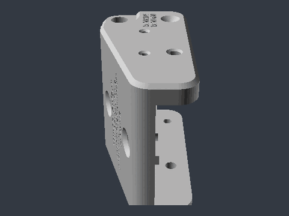 |
| actuator_top_base_2060_6000N_actuator_V1.1 | Top base for 2060 actuator, 6000N | 1x | 0.2mm layer / 6 outlines / 30% infill | **Strong** | Required | 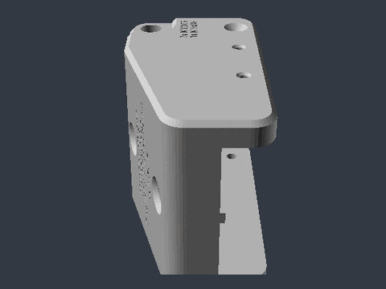 |
| beton_plate_holder_V1.0 | Holder for concrete foundation plates | 3x | 0.2mm layer / 6 outlines / 30% infill | **Strong** | Required | - |
| bottom_elevation_hinge_left_2060_V1.1 | Left elevation hinge for 2060 profile | 1x | 0.2mm layer / 6 outlines / 30% infill | **Strong** | Required | 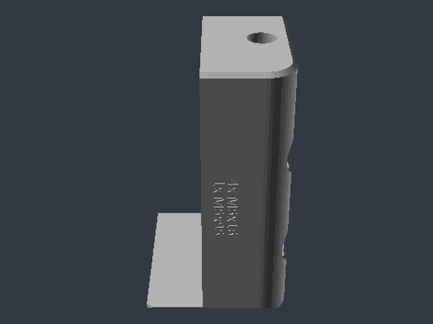 |
| bottom_elevation_hinge_male_2060_V1.0 | Male elevation hinge for 2060 profile | 2x | 0.2mm layer / 6 outlines / 30% infill | **Strong** | Required | 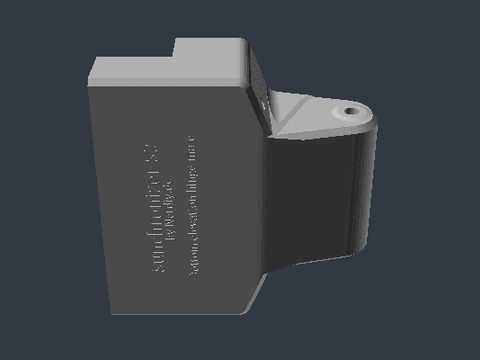 |
| bottom_elevation_hinge_right_2060_V1.1 | Right elevation hinge for 2060 profile | 1x | 0.2mm layer / 6 outlines / 30% infill | **Strong** | Required | 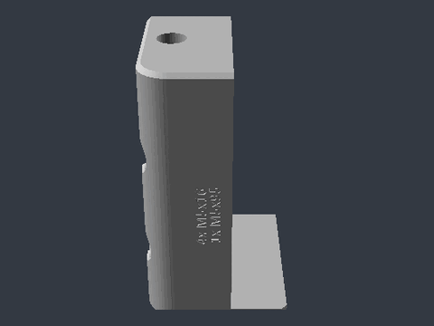 |
| bottom_t_cross_connector_2060_V1.2 | T-cross connector for 2060 profile, bottom | 1x | 0.2mm layer / 6 outlines / 30% infill | **Strong** | Required | 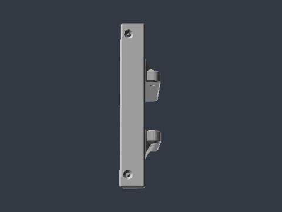 |
| cable_holder1_V1.0 | Cable holder type 1 | 1x | 0.2mm layer / 6 outlines / 30% infill | **Strong** | Required | 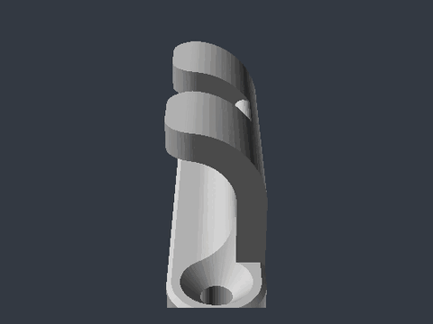 |
| cable_mount_single_V1.0 | Single cable mount | 12x | 0.2mm layer / 6 outlines / 30% infill | **Strong** | Required | 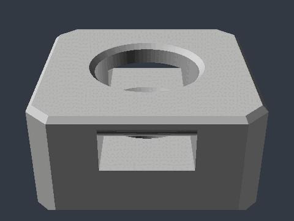 |
| electronics_box_lid_assembly_V1.0 | Lid assembly for electronics box | 1x | 0.2mm layer / 4 outlines / 20% infill | Standard | Required | - |
| electronics_housing_base_V1.1 | Base for electronics housing | 1x | 0.2mm layer / 4 outlines / 20% infill | Standard | Required | 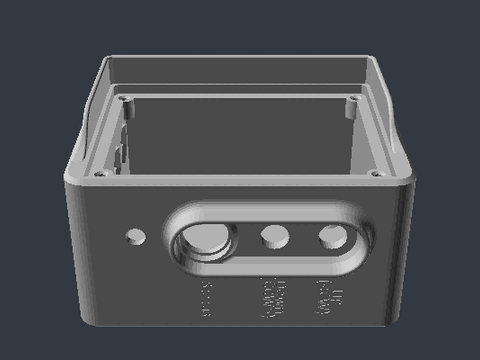 |
| elevation_motor_cover_lid_V1.0 | Lid for elevation motor cover | 1x | 0.2mm layer / 4 outlines / 20% infill | Standard | Required | 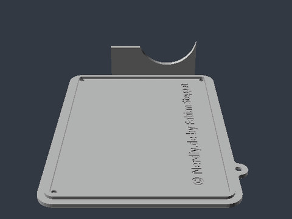 |
| elevation_motor_cover_V1.0 | Cover for elevation motor | 1x | 0.2mm layer / 4 outlines / 20% infill | Standard | Required | 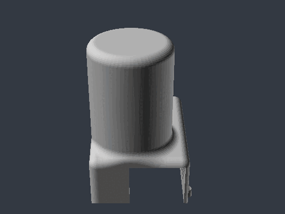 |
| panel_clamp_bottom_2060_V1.2 | Bottom clamp for 2060 panel | 1x | 0.2mm layer / 6 outlines / 30% infill | **Strong** | Required | 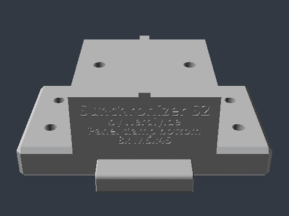 |
| panel_clamp_top_2060_V1.2 | Top clamp for 2060 panel | 1x | 0.2mm layer / 6 outlines / 30% infill | **Strong** | Required | 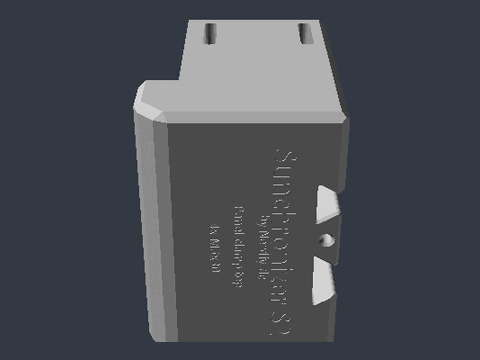 |
| panel_elevation_distancer_V1.0 | Distancer for panel elevation | 1x | 0.2mm layer / 4 outlines / 20% infill | Standard | Required | 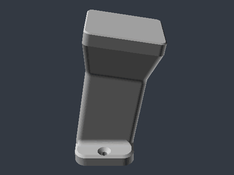 |
| panel_holder_bottom_bottom_clamp_V1.1 | Bottom clamp for panel holder | 2x | 0.2mm layer / 6 outlines / 30% infill | **Strong** | Required | 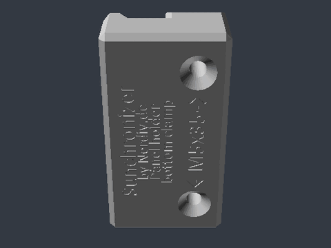 |
| panel_holder_bottom_top_clamp_center_V1.0 | Center top clamp for panel holder | 1x | 0.2mm layer / 6 outlines / 30% infill | **Strong** | Required | 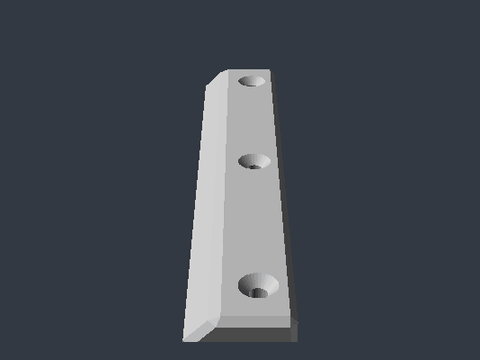 |
| panel_holder_bottom_top_clamp_V1.1 | Top clamp for panel holder | 2x | 0.2mm layer / 6 outlines / 30% infill | **Strong** | Required | 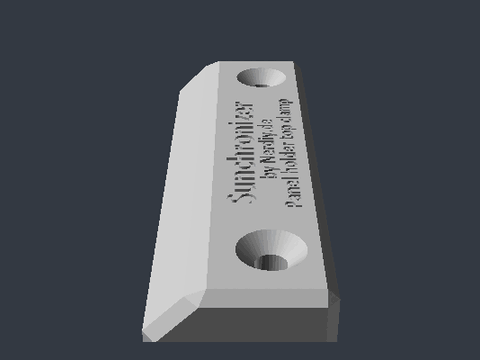 |
| profile_cap_top_V1.0 | Top profile cap | 1x | 0.2mm layer / 6 outlines / 30% infill | **Strong** | Required | 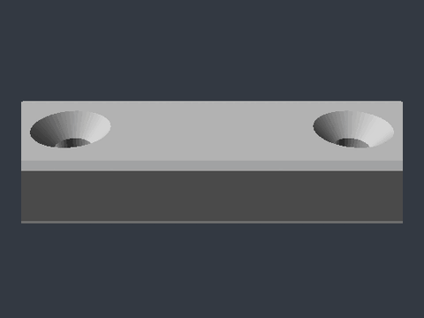 |
| profile_cap_V1.0 | Profile cap | 1x | 0.2mm layer / 6 outlines / 30% infill | **Strong** | Required | 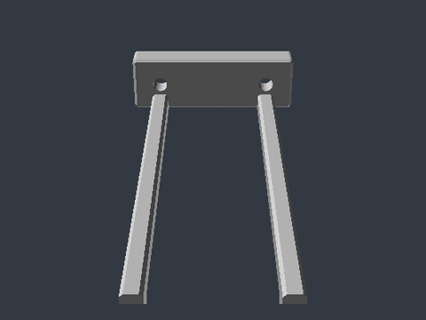 |
| sensornest_housing_base_V1.3 | Base for sensor nest housing | 1x | 0.2mm layer / 6 outlines / 30% infill | **Strong** | Required | 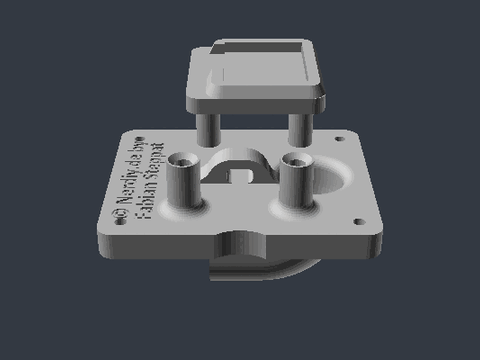 |
| sensornest_housing_cap_V1.1 | Cap for sensor nest housing | 1x | 0.2mm layer / 6 outlines / 30% infill | **Strong** | Required | 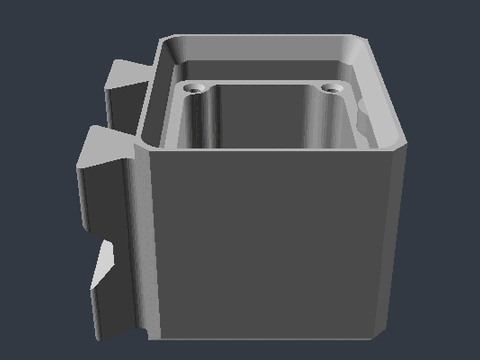 |
| top_t_cross_connector_2060_V1.1 | Top T-cross connector for 2060 profile | 1x | 0.2mm layer / 6 outlines / 30% infill | **Strong** | Required | 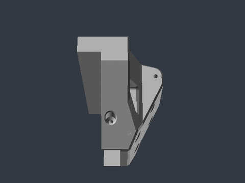 |

### Sunchronizer D2 - 3D Printed Parts

- **Total print time:** 4 days 8 hours 35 minutes
- **Total filament:** 3553 g

| Component | Description | Qty | Print Settings | Strength | Required/Optional | Preview |
| --- | --- | --- | --- | --- | --- | --- |
| azimut_base_hook_V1.0 | Mounting hook for azimuth base | 1x | 0.2mm layer / 6 outlines / 30% infill | **Strong** | Required | 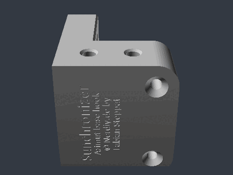 |
| azimut_base_hook_bottom_bearing_holder_V1.0 | Bottom bearing holder for azimuth base hook | 3x | 0.2mm layer / 6 outlines / 30% infill | **Strong** | Required | 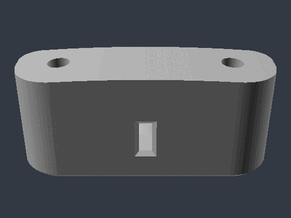 |
| azimut_base_hook_mount_back_V1.0 | Back mounting for azimuth base hook | 1x | 0.2mm layer / 6 outlines / 30% infill | **Strong** | Required | 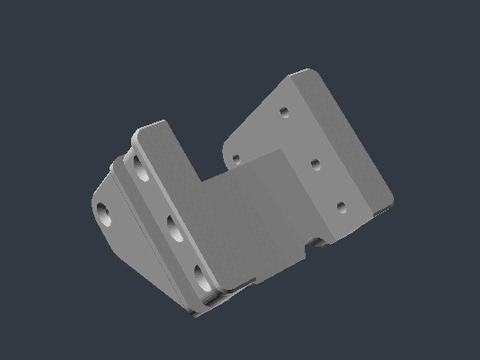 |
| azimut_base_hook_mount_sides_V1.0 | Side mount for azimuth base hook | 1x | 0.2mm layer / 6 outlines / 30% infill | **Strong** | Required | 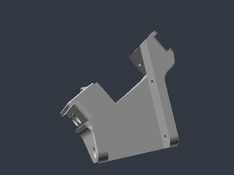 |
| azimut_base_hook_mount_sides_V1.0_MIR | Mirrored side mount for azimuth base hook | 1x | 0.2mm layer / 6 outlines / 30% infill | **Strong** | Required | 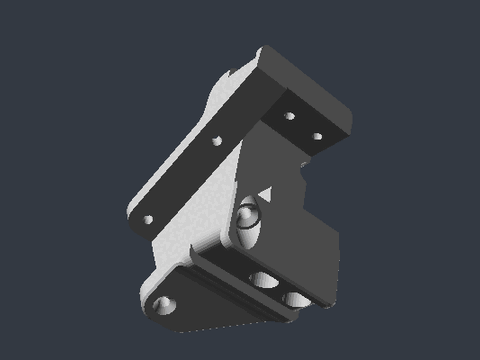 |
| azimuth_gear_box_dual_gear_V1.0 | Dual gear for azimuth gearbox | 1x | 0.2mm layer / 6 outlines / 30% infill | **Strong** | Required | 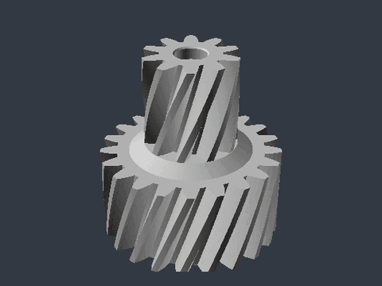 |
| azimuth_motor_mount_V1.2 | Motor mount for azimuth axis | 1x | 0.2mm layer / 4 outlines / 20% infill | Standard | Required | 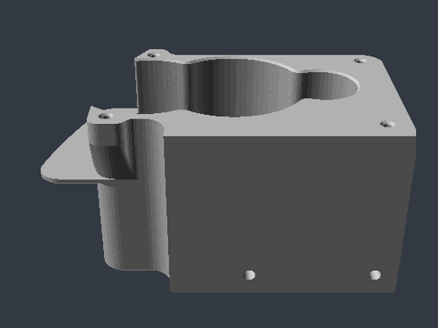 |
| azimuth_motor_mount_adapter_plate_V1.0 | Adapter plate for azimuth motor mount | 1x | 0.2mm layer / 6 outlines / 30% infill | **Strong** | Required | 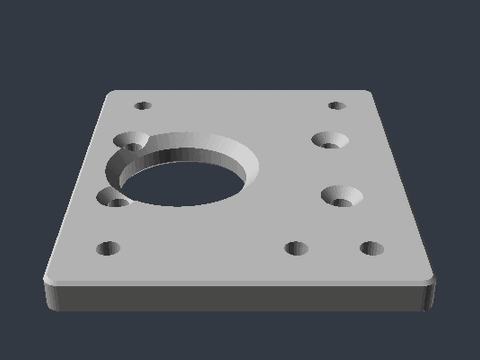 |
| azimuth_motor_mount_cover_V1.0 | Cover for azimuth motor mount | 1x | 0.2mm layer / 6 outlines / 30% infill | **Strong** | Required | 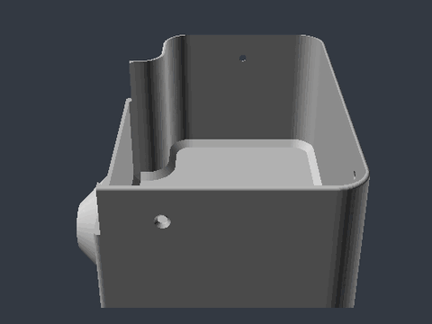 |
| azimuth_motor_mount_gear_support_V1.2 | Gear support for azimuth motor mount | 1x | 0.2mm layer / 6 outlines / 30% infill | **Strong** | Required | 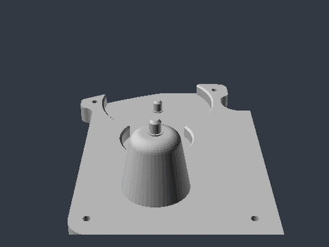 |
| base_ring_endstop_blocker_V1.2 | Endstop blocker for base ring | 1x | 0.2mm layer / 6 outlines / 30% infill | **Strong** | Required | 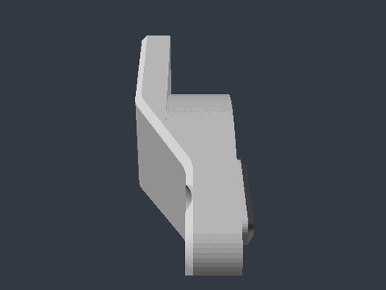 |
| base_ring_endstop_blocker_V1.2_MIR | Mirrored endstop blocker for base ring | 1x | 0.2mm layer / 6 outlines / 30% infill | **Strong** | Required | 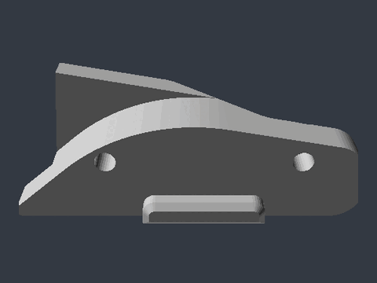 |
| base_ring_gear_V1.0 | Gear for base ring | 6x | 0.2mm layer / 6 outlines / 30% infill | **Strong** | Required | 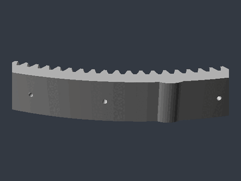 |
| base_ring_gearbox_gear_1_V1.0 | Gear 1 for base ring gearbox | 1x | 0.2mm layer / 6 outlines / 30% infill | **Strong** | Required | 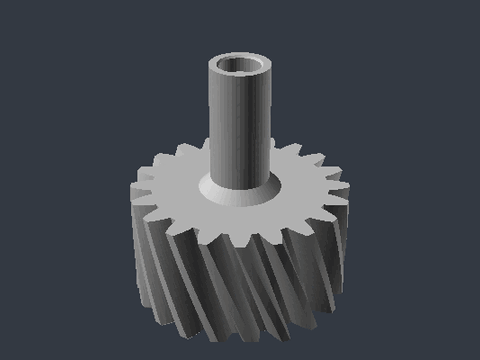 |
| base_ring_gearbox_gear_4_V1.0 | Gear 4 for base ring gearbox | 1x | 0.2mm layer / 6 outlines / 30% infill | **Strong** | Required | 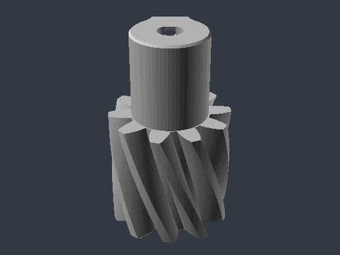 |
| base_ring_segment_V1.2 | Segment for base ring | 7x | 0.2mm layer / 4 outlines / 20% infill | Standard | Required | 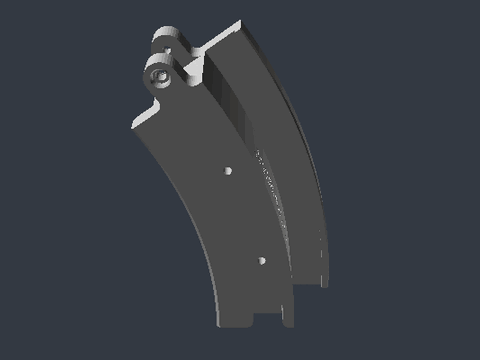 |
| base_ring_south_direction_indicator_V1.0 | South direction indicator for base ring | 1x | 0.2mm layer / 6 outlines / 30% infill | **Strong** | Required | 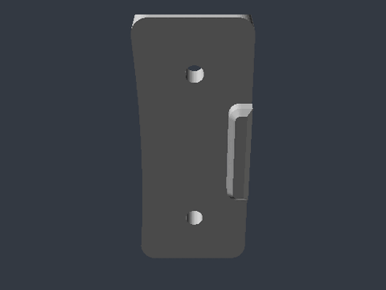 |
| endstop_switch_holder_V1.3 | Holder for endstop switch | 1x | 0.2mm layer / 4 outlines / 20% infill | Standard | Required | 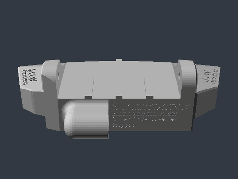 |
| endstop_switch_holder_cap_V1.1 | Cap for endstop switch holder | 1x | 0.2mm layer / 6 outlines / 30% infill | **Strong** | Required | 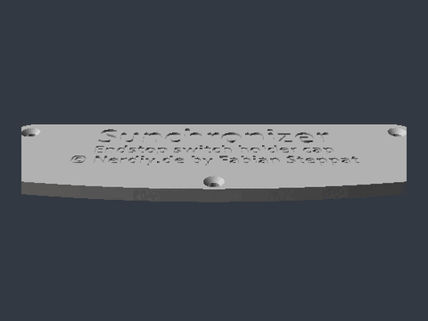 |
| ring_protection_cover_center_V1.1 | Center protection cover for ring | 1x | 0.2mm layer / 4 outlines / 20% infill | Standard | Required | 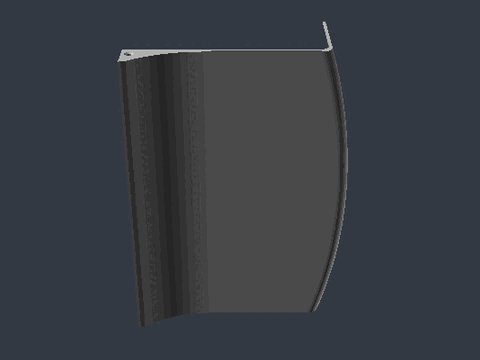 |
| ring_protection_cover_side_V1.1 | Side protection cover for ring | 1x | 0.2mm layer / 4 outlines / 20% infill | Standard | Required | 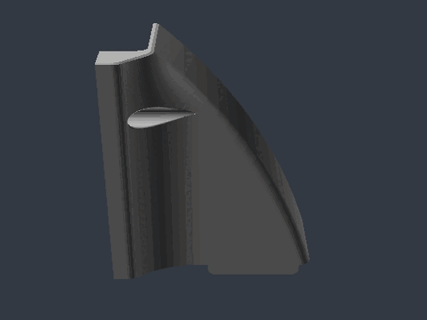 |
| ring_protection_cover_side_V1.1_MIR | Mirrored side protection cover for ring | 1x | 0.2mm layer / 4 outlines / 20% infill | Standard | Required | 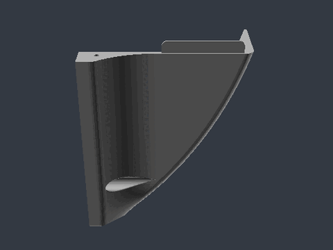 |


**Last Updated**: March 2026


