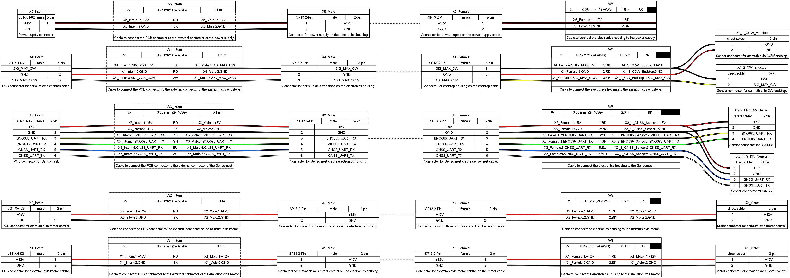
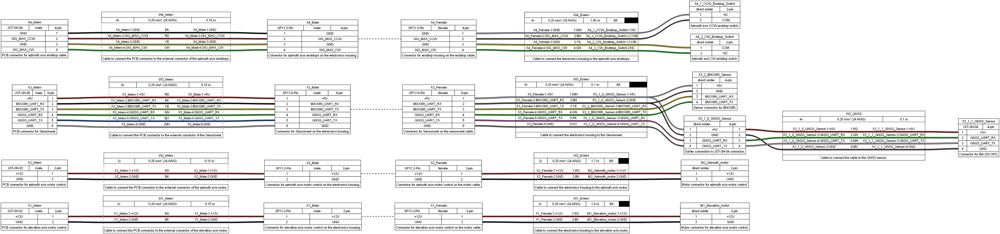

# Sunchronizer Cable Plans

This folder contains WireViz-based cable plans for different PCB versions. You can use these files to see which cables/wires are required, their lengths, and how they are connected.

For purchasable cable suggestions (including shopping links), see the main BOM: [../../bom/BOM.md](../../bom/BOM.md).

Each PCB folder contains the typical WireViz files:
- `.yaml` source definition (authoritative source)
- `.html` generated wiring diagram
- `.bom.tsv` generated BOM table

In most cases, the newest PCB version should be used for new builds.

## PCB v1.4 (Newest)

Wiring diagram preview:

[](pcb_v1.4/sunchronizer_d2_v1.4_wiring_plan.png)

Files:
- [pcb_v1.4/sunchronizer_d2_v1.4_wiring_plan.html](https://htmlpreview.github.io/?https://raw.githubusercontent.com/Nerdiyde/Sunchronizer/main/docu/cable_plan/pcb_v1.4/sunchronizer_d2_v1.4_wiring_plan.html)
- [pcb_v1.4/sunchronizer_d2_v1.4_wiring_plan.bom.tsv](pcb_v1.4/sunchronizer_d2_v1.4_wiring_plan.bom.tsv)
- [pcb_v1.4/sunchronizer_d2_v1.4_wiring_plan.yaml](pcb_v1.4/sunchronizer_d2_v1.4_wiring_plan.yaml)

Cable overview (from YAML):

| Cable | Purpose | Cores | Length | Cross-section |
| --- | --- | --- | --- | --- |
| W1 | Electronics housing to elevation motor | 2 | 0.8 m | 0.25 mm2 |
| W2 | Electronics housing to azimuth motor | 2 | 1.5 m | 0.25 mm2 |
| W3 | Electronics housing to sensornest | 6 | 2.3 m | 0.25 mm2 |
| W4 | Electronics housing to azimuth endstops | 3 | 0.75 m | 0.25 mm2 |
| W5 | Electronics housing to power supply | 2 | 1.5 m | 0.25 mm2 |
| W1_Intern | PCB to X1 housing connector | 2 | 0.1 m | 0.25 mm2 |
| W2_Intern | PCB to X2 housing connector | 2 | 0.1 m | 0.25 mm2 |
| W3_Intern | PCB to X3 housing connector | 6 | 0.1 m | 0.25 mm2 |
| W4_Intern | PCB to X4 housing connector | 3 | 0.1 m | 0.25 mm2 |
| W5_Intern | PCB to X5 housing connector (power) | 2 | 0.1 m | 0.25 mm2 |

## PCB v1.3

Wiring diagram preview:

[](pcb_v1.3/sunchronizer_d2_v1.3_wiring_plan.png)

Files:
- [pcb_v1.3/sunchronizer_d2_v1.3_wiring_plan.html](https://htmlpreview.github.io/?https://raw.githubusercontent.com/Nerdiyde/Sunchronizer/main/docu/cable_plan/pcb_v1.3/sunchronizer_d2_v1.3_wiring_plan.html)
- [pcb_v1.3/sunchronizer_d2_v1.3_wiring_plan.bom.tsv](pcb_v1.3/sunchronizer_d2_v1.3_wiring_plan.bom.tsv)
- [pcb_v1.3/sunchronizer_d2_v1.3_wiring_plan.yaml](pcb_v1.3/sunchronizer_d2_v1.3_wiring_plan.yaml)

Cable overview (from YAML):

| Cable | Purpose | Cores | Length | Cross-section |
| --- | --- | --- | --- | --- |
| W1_Extern | Electronics housing to elevation motor | 2 | 1.5 m | 0.25 mm2 |
| W2_Extern | Electronics housing to azimuth motor | 2 | 1.7 m | 0.25 mm2 |
| W3_Extern | Electronics housing to sensornest | 6 | 0.7 m | 0.25 mm2 |
| W3_GNSS | Branch cable to GNSS sensor | 4 | 0.1 m | 0.25 mm2 |
| W4_Extern | Electronics housing to azimuth endstops | 4 | 1.85 m | 0.25 mm2 |
| W1_Intern | PCB to X1 housing connector | 2 | 0.15 m | 0.25 mm2 |
| W2_Intern | PCB to X2 housing connector | 2 | 0.15 m | 0.25 mm2 |
| W3_Intern | PCB to X3 housing connector | 6 | 0.15 m | 0.25 mm2 |
| W4_Intern | PCB to X4 housing connector | 4 | 0.15 m | 0.25 mm2 |

## Regenerating WireViz Outputs

If you change a YAML file, regenerate the outputs with WireViz:

```bash
pip install wireviz
wireviz pcb_v1.3/sunchronizer_d2_v1.3_wiring_plan.yaml
wireviz pcb_v1.4/sunchronizer_d2_v1.4_wiring_plan.yaml
```

Notes:
- The YAML files are the source of truth.
- Do not manually edit generated `.html` or `.bom.tsv` files.
