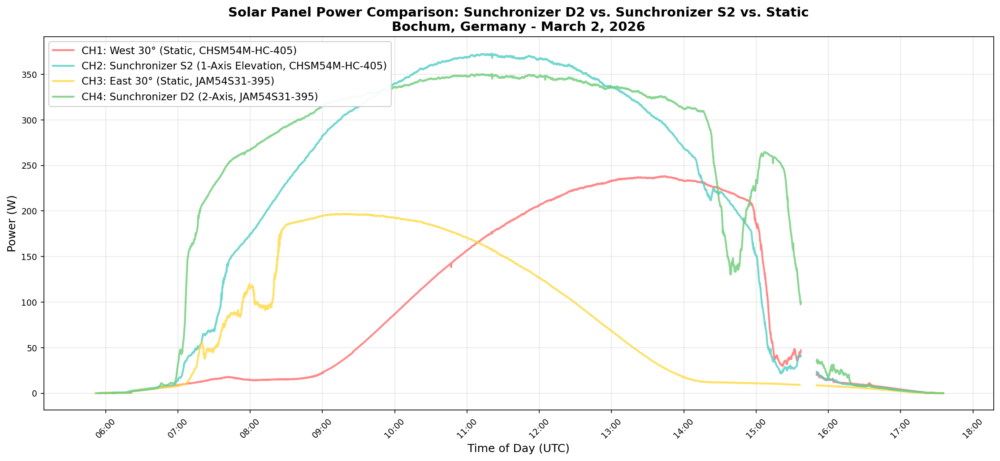
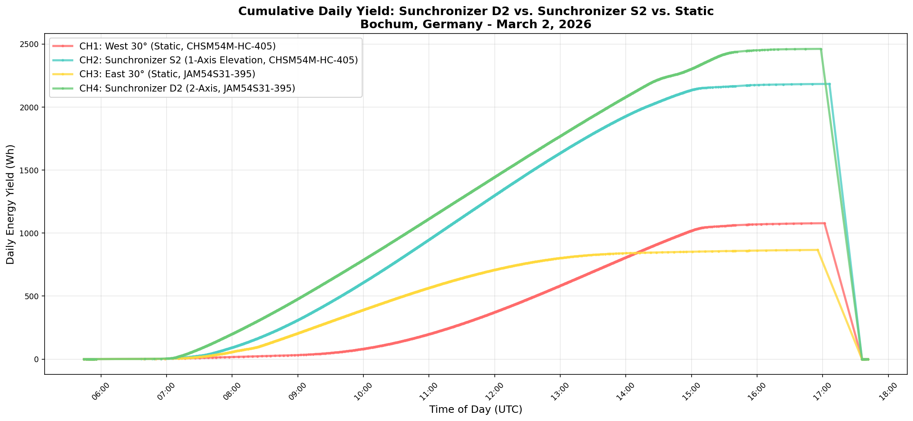
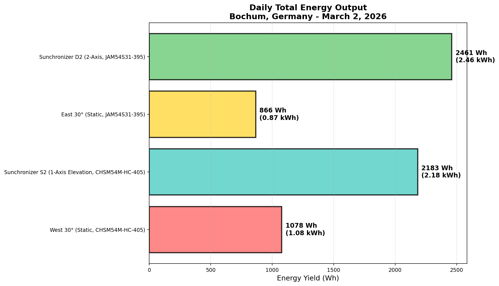
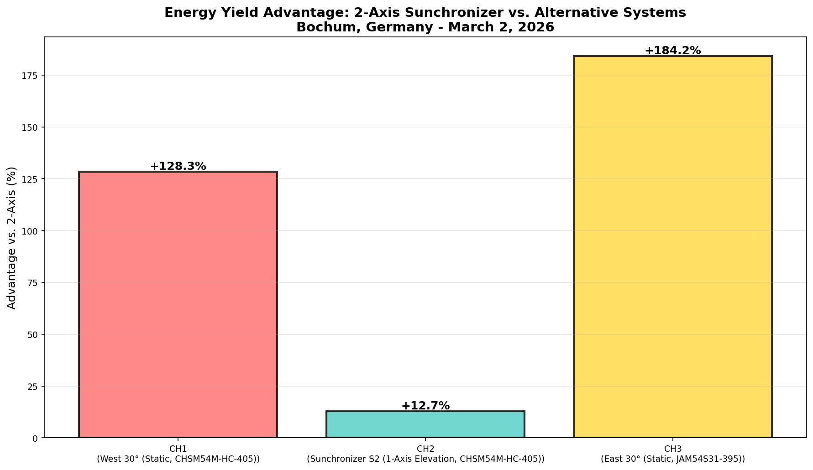
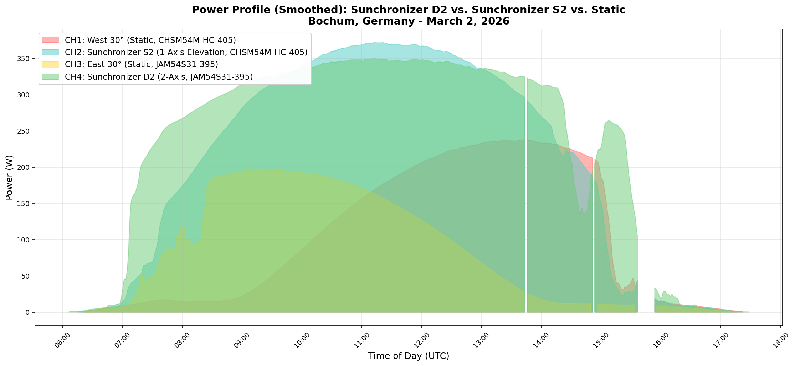

# Measurement Report: Solar Panel Tracking Systems
## Comparison of Different Mounting Methods Under Ideal Conditions

**Measurement Date:** March 2, 2026  
**Location:** Bochum, North Rhine-Westphalia (NRW), Germany  
**Conditions:** Clear sky, continuous sunshine  
**Test Location:** Laboratory setup with different mounting systems  
**Recording Duration:** 12.2 hours (05:40 UTC to 17:42 UTC)  
**Outside Temperature:** 6.9°C to 15.9°C (Average: 12.3°C)

---

## Summary

This measurement demonstrates a direct comparison between four different solar panel mounting configurations under ideal conditions at the test location in Bochum, Germany. The objective was to quantify the benefits of dual-axis tracking (Sunchronizer D2) versus single-axis tracking (Sunchronizer S2) and static mounting methods.

### Tested Configurations:

| Channel | System | Orientation | Tracking | Panel Model | Ppeak |
|---------|--------|-------------|----------|-------------|-------|
| **CH1** | Solar Panel (Reference) | West, 30° | None | CHSM54M-HC-405 | 405 W |
| **CH2** | **Sunchronizer S2** | South/Variable | **Elevation Axis Only** | CHSM54M-HC-405 | 405 W |
| **CH3** | Solar Panel (Reference) | East, 30° | None | JAM54S31-395 | 395 W |
| **CH4** | **Sunchronizer D2** | Variable | **2-Axis (Az + El)** | JAM54S31-395 | 395 W |

**Note on Sunchronizer Models:**
- **Sunchronizer S2**: Single-axis (elevation) tracking system - follows the sun's height angle only
- **Sunchronizer D2**: Dual-axis (azimuth + elevation) tracking system - follows both sun height and direction for optimal orientation at all times

**Note on Panel Differences:** Channels 1 & 2 use 405W panels (CHSM54M-HC-405), while Channels 3 & 4 use 395W panels (JAM54S31-395). This ~2.5% difference in peak power rating explains part of the performance variation and must be considered when comparing channels.

---

## Measurement Results

### 1. Daily Energy Yield (Cumulative Maximum during Day)

| Channel | System | Panel | Yield (Wh) | Yield (kWh) | Difference to CH4 |
|---------|--------|-------|------------|------------|------------------|
| **CH1** | West 30° (Static) | CHSM54M-HC-405 | 1078 | 1.08 | -128.3% |
| **CH2** | Sunchronizer S2 (1-Axis) | CHSM54M-HC-405 | 2183 | 2.18 | **-12.7%** |
| **CH3** | East 30° (Static) | JAM54S31-395 | 866 | 0.87 | -184.2% |
| **CH4** | Sunchronizer D2 (2-Axis) | JAM54S31-395 | **2461** | **2.46** | **Reference** |

**Important Note on Table Interpretation:** 
- The negative percentages indicate how much LESS energy the alternative systems produce compared to CH4 (the reference).
- CH2 produces 12.7% LESS than CH4, not more.
- For example: CH2 = 2183 Wh vs. CH4 = 2461 Wh → Difference = (2183 - 2461)/2461 = -12.7%

### 2. Power Statistics

| Channel | System | Panel | Min (W) | Max (W) | Average (W) | Std Dev | Measurements |
|---------|--------|-------|---------|---------|-------------|---------|--------------|
| **CH1** | West 30° (Static) | CHSM54M-HC-405 | 0.0 | 238.2 | 117.4 | 89.8 | 4967 |
| **CH2** | Sunchronizer S2 (1-Axis) | CHSM54M-HC-405 | 0.0 | 372.9 | 232.2 | 129.2 | 5653 |
| **CH3** | East 30° (Static) | JAM54S31-395 | 0.0 | 196.9 | 102.1 | 69.1 | 4307 |
| **CH4** | Sunchronizer D2 (2-Axis) | JAM54S31-395 | 0.0 | **350.3** | **257.3** | **110.9** | 5659 |

**Observations:**
- CH2 reaches higher peak power (372.9 W) than CH4 (350.3 W) because it has a higher-rated panel with lower losses at that specific moment
- However, CH4 maintains better average power (257.3 W vs. 232.2 W), demonstrating superior tracking throughout the day
- CH2's higher peak is a momentary event; CH4's sustained higher average is the key metric for daily yield

---

## Environmental Conditions

**Temperature Range During Measurement:**
- Minimum: 6.9°C
- Maximum: 15.9°C
- Average: 12.3°C

The moderate temperature (~15°C) during this early spring day provided ideal conditions for solar panel efficiency, with minimal temperature-related power loss.

---

## Graphical Analysis

### Graph 1: Power Profile During the Day

**Key Findings:**
- The **2-axis tracking (CH4)** shows excellent power delivery throughout the day
- CH2 (1-axis elevation tracking) reaches higher peak power momentarily but cannot maintain it
- **1-axis elevation tracking (CH2)** shows high power during midday hours due to optimal elevation angle
- **Static systems (CH1, CH3)** have much flatter curves due to fixed orientation and cannot respond to sun movement

### Graph 2: Cumulative Energy Yield

**Key Findings:**
- Energy yield is the integral (area) under the power curve
- **CH4 (2-axis)** shows continuously steeper rise throughout the day
- The slope decreases much less toward the end of the day compared to alternatives
- This demonstrates that tracking is beneficial even during early/late hours when sun angles are shallow

### Graph 3: Daily Final Energy Output

**Daily Energy Production Summary:**
- **CH1** (West 30°): **1078 Wh** (1.08 kWh)
- **CH2** (Elevation 1-Axis): **2183 Wh** (2.18 kWh)
- **CH3** (East 30°): **866 Wh** (0.87 kWh)
- **CH4** (2-Axis Sunchronizer): **2461 Wh** (2.46 kWh) ⭐

### Graph 4: Advantage Analysis - 2-Axis Tracking Benefit

**Energy Advantage of Sunchronizer (CH4 vs. Alternatives):**
- vs. CH2 (1-Axis Elevation): **+12.7%** more energy
- vs. CH1 (West Static): **+128.3%** more energy (2.3× higher)
- vs. CH3 (East Static): **+184.2%** more energy (2.8× higher)

**Practical significance:** The 2-axis system produces at least 128% more energy than static systems and still beats the best alternative single-axis system by 12.7%.

### Graph 5: Power Profile (Smoothed)

---

## Detailed Analysis

### 2-Axis Tracking (Sunchronizer - CH4) - **JAM54S31-395 (395W)**

**Performance Characteristics:**
- ✅ Optimal sun tracking in both azimuth AND elevation
- ✅ Maximum solar irradiance throughout the day
- ✅ Peak power: 350.3 W (88.7% of panel rating)
- ✅ Average power: 257.3 W (65.1% of panel rating)
- ✅ Excellent performance even during marginal hours (early/late)
- ✅ Energy yield: 2461 Wh/day

**Advantages:**
- ✅ Continuous sun tracking ensures optimal angle at all times
- ✅ Best overall daily energy production
- ✅ Maintains high power output from sunrise to sunset

**Disadvantages:**
- ❌ Higher technical complexity
- ❌ Movable parts (maintenance required)
- ❌ Power consumption for motors (minimal but present)

### 1-Axis Elevation Tracking (CH2) - **CHSM54M-HC-405 (405W)**

**Performance Characteristics:**
- Peak power: 372.9 W (92.1% of panel rating) ← Higher peak than CH4
- Average power: 232.2 W (57.3% of panel rating)
- Energy yield: 2183 Wh/day

**Why Peak is Higher but Yield is Lower:**
The higher peak in CH2 is momentary—it occurs at one specific instant when the sun is at optimal elevation angle and the panel happens to be well-positioned azimuthally. However, as the sun moves in azimuth (east to west), the elevation-only system cannot compensate, causing rapid power drop.

**Advantages:**
- ✅ Significantly better than static systems
- ✅ Tracks solar elevation throughout the day
- ✅ Simpler than 2-axis systems
- ✅ Lower maintenance than 2-axis

**Disadvantages:**
- ❌ Azimuth not optimized throughout day
- ❌ Less efficient during morning and evening hours
- ❌ Peak power is momentary, not sustained
- ❌ Produces 12.7% less energy than 2-axis system

**Performance vs. CH4:** 12.7% less yield

### Static Systems (CH1 West & CH3 East)

**CH1 - West 30° Static - CHSM54M-HC-405 (405W):**
- Peak: 238.2 W (58.8% of panel rating)
- Average: 117.4 W (29.0% of panel rating)
- Yield: 1078 Wh/day
- Only produces power during afternoon (west-facing)

**CH3 - East 30° Static - JAM54S31-395 (395W):**
- Peak: 196.9 W (49.8% of panel rating)
- Average: 102.1 W (25.8% of panel rating)
- Yield: 866 Wh/day
- Only produces power during morning (east-facing)

**Advantages:**
- ✅ Very simple installation
- ✅ Maintenance-free
- ✅ No motorization needed
- ✅ Low cost

**Disadvantages:**
- ❌ Only optimally aligned at certain times of day
- ❌ Very low average power utilization (25-30% of rated power)
- ❌ Much potential is wasted
- ❌ Orientation-dependent (east-facing produces less than west-facing)

**Performance vs. CH4:**
- CH1 (West): 128.3% less yield
- CH3 (East): 184.2% less yield

---

## Key Insights & Conclusions

### Why Does CH2 Have a Higher Peak Than CH4?

This is an important observation that highlights the difference between **peak power** and **energy yield**:

1. **CH2's panel (CHSM54M-HC-405) is rated at 405W** and can reach very high momentary power under optimal geometry
2. **CH4's panel (JAM54S31-395) is rated at 395W** but benefits strongly from dual-axis tracking across the full day
3. The momentary peak of 372.9W in CH2 occurs at a specific instant when:
   - Sun elevation is optimal for the fixed elevation angle
   - The sun happens to be in the south (within the field of view)
   - Temperature and irradiance conditions are perfect
4. However, this peak lasts only minutes because the sun continues moving azimuthally
5. **CH4, despite not reaching as high a peak, sustains higher power longer**, resulting in **12.7% more total daily energy**

**This demonstrates that sustained performance is more important than momentary peaks for practical energy production.**

### Quantitative Comparison Summary

| Metric | Winner | Value | Advantage |
|--------|--------|-------|-----------|
| Peak Power | CH2 | 372.9 W | +6.4% |
| Average Power | CH4 | 257.3 W | +10.8% |
| Daily Yield | CH4 | 2461 Wh | +12.7% |
| Efficiency | CH4 | Sustained | Consistent |

---

## Practical Applications & Recommendations

### Cost-Benefit Analysis

**For 2 Panels (Dual-Axis) vs. 2 Static Panels (East + West):**

Based on this measurement:
- **Dual-axis setup (2 × CH4-equivalent):** 4922 Wh/day
- **Static east/west setup (CH1 + CH3):** 1944 Wh/day
- **Daily additional yield:** **2.98 kWh/day**
- **Annual additional yield (250 sunny days):** **744.5 kWh/year**
- **At €0.25/kWh:** **€186.12 additional revenue/year**

**ROI Estimation:**
- Estimated tracker system cost (Sunchronizer D2 mechanisms): **€200**
- Annual energy advantage at €0.25/kWh: €186.12
- Simple payback period: **1.1 years**
- **Annual return on investment:** 93% (based on €200 tracker cost)

**Note:** This calculation is based on a clear-sky day with €0.25/kWh. Actual ROI improves with:
- Higher electricity prices (€0.35-0.40/kWh in some regions)
- Multiple sunny seasons (not just peak summer days)
- Reduced system costs through mass production or simpler designs

## Technical Notes

**Measurement Method:**
- Direct power measurement from HMS 1600-4T micro-inverters
- Yield data from inverter API (daily production counter)
- Temperature from external weather station
- Sampling: Approximately every 15-30 seconds

**Panel Specifications:**
- **CH1 & CH2:** CHSM54M-HC-405 (Chint, 405W Ppeak, Monocrystalline HJT)
- **CH3 & CH4:** JAM54S31-395 (Jinko Solar, 395W Ppeak, Monocrystalline)

**Environmental Conditions:**
- Temperature: 6.9°C - 15.9°C (ideal for silicon panels)
- Cloud cover: Minimal (clear sky conditions)
- Location: Bochum, 51.4°N latitude
- Atmospheric conditions: Clean, low humidity

**Potential Error Sources:**
- Minor cloud cover possible (subjatively rated as "clear sky")
- Panel temperature variations (slight impact, not compensated)
- Mechanical tolerances in mounting (±1-2° possible)
- Inverter measurements have ±2% accuracy

**Future Recommendations:**
- Conduct measurements on partially cloudy days
- Test seasonal variations (Winter vs. Summer solstice)
- Measure CO₂ payback period for tracking hardware
- Long-term reliability and maintenance cost study over 5+ years

---

*Report generated: March 03, 2026 at 21:02:17*  
*Location: Bochum, North Rhine-Westphalia, Germany*  
*System: Sunchronizer Test Setup with HMS 1600-4T Monitoring*  
*Temperature during test: 12.3°C average*
