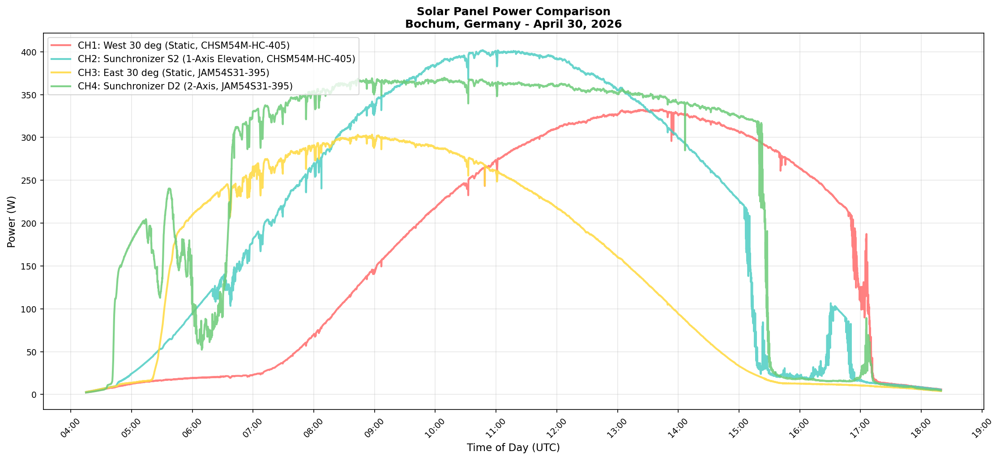
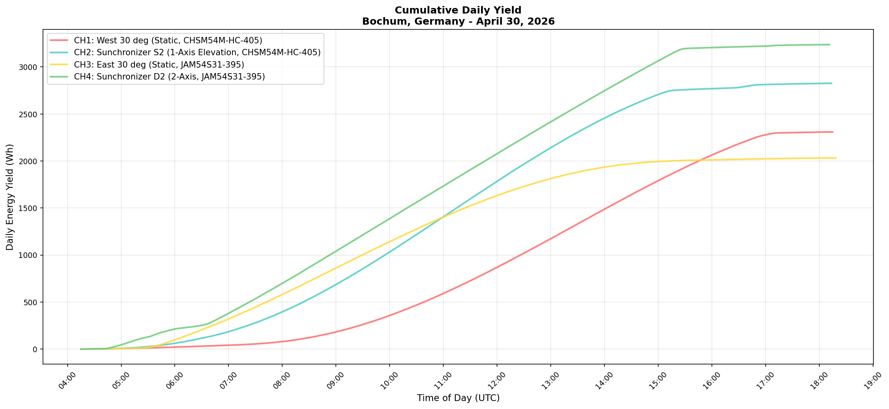
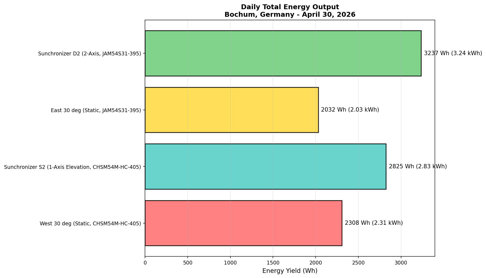
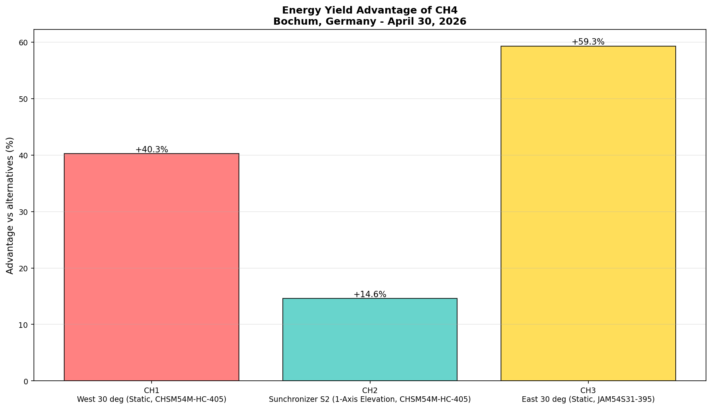
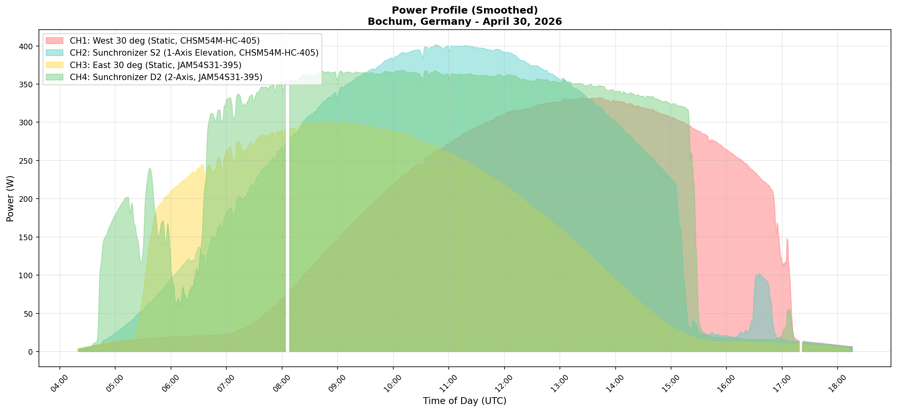
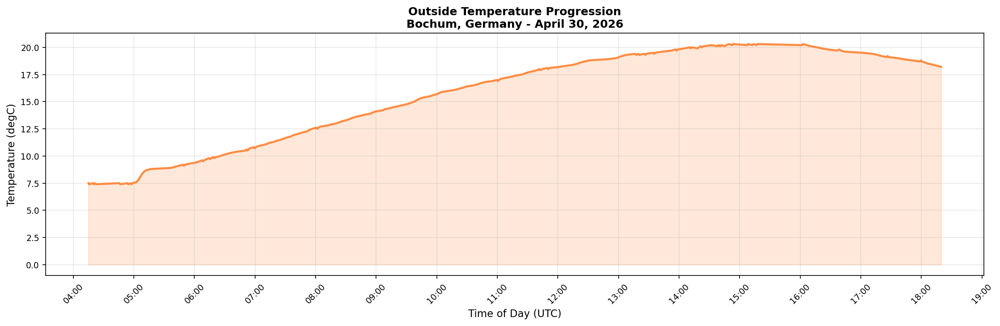

# Measurement Report: Solar Panel Tracking Systems
## Comparison of Different Mounting Methods Under Ideal Conditions

**Measurement Date:** April 30, 2026
**Location:** Bochum, North Rhine-Westphalia (NRW), Germany
**Conditions:** Based on recorded field data
**Recording Duration:** 14.1 hours (04:15 UTC to 18:19 UTC)
**Outside Temperature:** 7.4 degC to 20.3 degC (Average: 15.1 degC)

---

### Tracking Overview (Video + Testbench)

<table>
	<tr>
		<td width="70%" valign="top">
			
			
<em>10-second timelapse of the daytime tracking period. The Sunchronizer D2 dual-axis tracker continuously reorients the panel to follow the sun across the sky.</em> 
			<em>Full-quality video (VP9/WebM): <a href="solarCam1_20260430_0000_1340_10s.webm">solarCam1_20260430_0000_1340_10s.webm</a></em>

		</td>
		<td width="30%" valign="top">
	 
			
<em>Physical testbench setup used for this measurement series.</em>

		</td>
	</tr>
</table>

---

## Summary

This analysis compares four mounting concepts using synchronized power and yield telemetry:
- CH1: Static West 30 deg
- CH2: Sunchronizer S2 (single-axis elevation)
- CH3: Static East 30 deg
- CH4: Sunchronizer D2 (dual-axis)

---

## Measurement Results

### 1. Daily Energy Yield

| Channel | System | Panel | Yield (Wh) | Yield (kWh) | Difference to CH4 |
|---------|--------|-------|------------|-------------|-------------------|
| **CH1** | West 30 deg (Static, CHSM54M-HC-405) | CHSM54M-HC-405 | 2308 | 2.31 | -28.7% |
| **CH2** | Sunchronizer S2 (1-Axis Elevation, CHSM54M-HC-405) | CHSM54M-HC-405 | 2825 | 2.83 | -12.7% |
| **CH3** | East 30 deg (Static, JAM54S31-395) | JAM54S31-395 | 2032 | 2.03 | -37.2% |
| **CH4** | Sunchronizer D2 (2-Axis, JAM54S31-395) | JAM54S31-395 | 3237 | 3.24 | Reference |

### 2. Power Statistics

| Channel | System | Panel | Min (W) | Max (W) | Average (W) | Std Dev | Measurements |
|---------|--------|-------|---------|---------|-------------|---------|--------------|
| **CH1** | West 30 deg (Static, CHSM54M-HC-405) | CHSM54M-HC-405 | 2.3 | 332.8 | 197.2 | 118.7 | 6953 |
| **CH2** | Sunchronizer S2 (1-Axis Elevation, CHSM54M-HC-405) | CHSM54M-HC-405 | 3.0 | 401.9 | 225.1 | 144.0 | 8055 |
| **CH3** | East 30 deg (Static, JAM54S31-395) | JAM54S31-395 | 2.9 | 303.3 | 179.3 | 108.0 | 6929 |
| **CH4** | Sunchronizer D2 (2-Axis, JAM54S31-395) | JAM54S31-395 | 2.2 | 369.7 | 257.4 | 134.6 | 8177 |

---

## Graphical Analysis

### Graph 1: Power Profile During the Day

### Graph 2: Cumulative Energy Yield

### Graph 3: Daily Final Energy Output

### Graph 4: Advantage Analysis

### Graph 5: Power Profile (Smoothed)

### Graph 6: Outside Temperature Progression

### Graph 7: Tracking Deviation

### Graph 8: Time-Series Performance Ratio

---

## Notes

- This report is generated directly from the CSV telemetry in this folder.
- If additional controller telemetry is available, graphs 7 and 8 can be regenerated with richer detail.

---

*Report generated: April 30, 2026*
