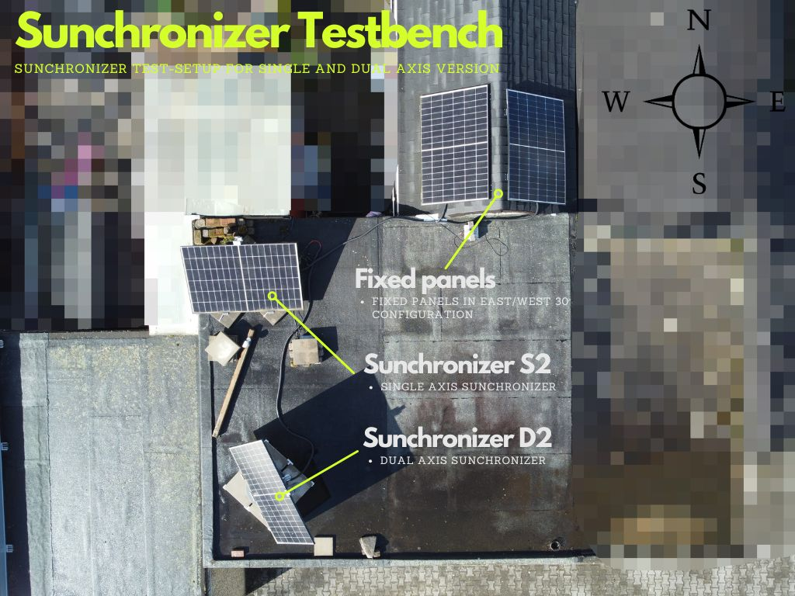
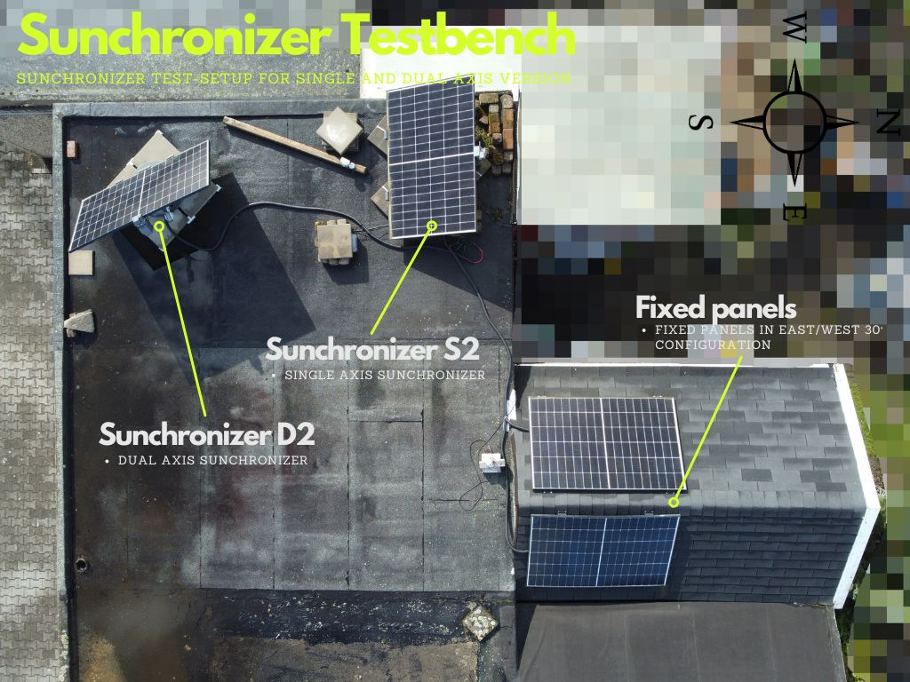
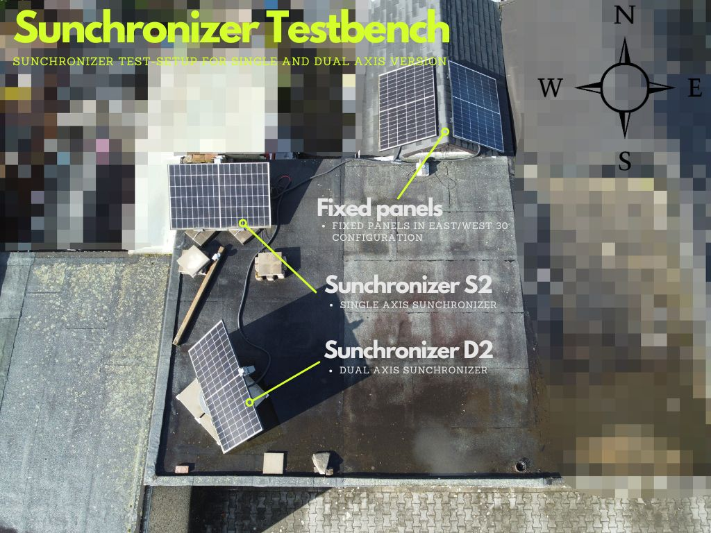

# Sunchronizer Measurement Overview
## Solar Panel Tracking System Performance Data

**Location:** Bochum, North Rhine-Westphalia, Germany  
**Test Setup:** 4-channel comparison with HMS 1600-4T micro-inverters  
**Last Updated:** March 18, 2026

---

## Overview

This document provides a quick summary of all solar panel tracking measurements conducted in Bochum, Germany. Each day compares four mounting configurations across 4 measurement channels using HMS 1600-4T micro-inverters.

## Test Configuration

| CH | System | Orientation | Tracking | Panel | Power |
|----|--------|-------------|----------|-------|-------|
| 1 | Static Ref. | West 30° | None | CHSM54M-HC-405 | 405 W |
| 2 | **Sunchronizer S2** | Variable | Elevation | CHSM54M-HC-405 | 405 W |
| 3 | Static Ref. | East 30° | None | JAM54S31-395 | 395 W |
| 4 | **Sunchronizer D2** | Variable | 2-Axis | JAM54S31-395 | 395 W |

### Testbench Setup

The following photos show the real testbench used for all measurement series and analysis:

	
	
	

* Testbench for Sunchronizer S2/D2 and static reference panels (all channels measured in parallel)  
---

## Measurement Data

### Daily Results Overview

| Date | Weather | Duration | Temp (Avg) | CH1 West (Wh) | CH2 S2 (Wh) | CH3 East (Wh) | CH4 D2 (Wh) | D2 Avg Power | Median Elevation Deviation (D2) | Median Azimuth Deviation (D2) | Report |
|------|---------|----------|-----------|---------------|-------------|---------------|-------------|--------------|----------------------------------|--------------------------------|--------|
| Mar 2 | Clear Sky | 12.2h | 12.3°C | 1,078 | 2,183 | 866 | **2,461** | 257.3 W | 18.90° | 1.59° | [Link](2026-03-02_bochum_tracking_analysis/ANALYSIS_REPORT_2026-03-02.md) |
| Mar 3 | Clear Sky | 13.2h | 12.1°C | 1,059 | 2,073 | 852 | **2,310** | 233.9 W | 19.40° | 1.56° | [Link](2026-03-03_bochum_tracking_analysis/ANALYSIS_REPORT_2026-03-03.md) |
| Mar 5 | Clear Sky | 15.1h | 11.4°C | 1,116 | 2,136 | 903 | **2,394** | 242.7 W | 18.88° | 1.60° | [Link](2026-03-05_bochum_tracking_analysis/ANALYSIS_REPORT_2026-03-05.md) |
| Mar 18 | Clear Sky | 13.7h | 12.7°C | 1,368 | 2,324 | 1,194 | **2,731** | 271.7 W | 14.86° | 1.58° | [Link](2026-03-18_bochum_tracking_analysis/ANALYSIS_REPORT_2026-03-18.md) |
| **Avg** | - | **13.6h** | **12.1°C** | **1,155** | **2,179** | **954** | **2,474** | **251.4 W** | **18.01°** | **1.58°** | - |

### Performance Summary

**Sunchronizer D2 (CH4) Advantages:**
- **vs. Static East/West:** +134.6% average daily energy (2,474 Wh vs. avg 1,054 Wh)
- **vs. Single-Axis S2:** +13.5% average daily energy (2,474 Wh vs. 2,179 Wh)
- Average daily yield: **2.47 kWh** (range: 2.31-2.73 kWh)

**Interpretation Note (all measurement series):**
- For elevation-based tracking (especially CH2), the controller cannot always approach the solar-optimal elevation angle further because the tracker is physically constrained by minimum and maximum elevation limits.
- The median axis deviation is a practical tracking quality indicator: smaller median values indicate better typical tracking accuracy during the day.
- The median describes typical behavior, while the 95th percentile captures occasional larger deviations.

---

## Technical Information

- **Location:** Bochum, 51.4°N latitude
- **Monitoring:** HMS 1600-4T micro-inverters (±2% measurement accuracy)
- **Temperature:** 4.3-17.0°C range across measurements
- **Conditions:** Clear sky days with continuous sunshine

For detailed analysis, graphs, and technical specifications, see individual measurement reports.
